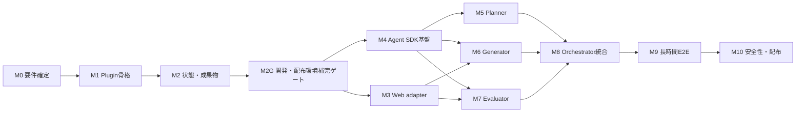

# harness-longrun-app-dev 開発計画

| 項目 | 内容 |
| --- | --- |
| 文書番号 | HLAD-DP-001 |
| バージョン | 0.1.4 |
| 作成日 | 2026-09-02 |
| ステータス | 初版 |
| 参照要件 | HLAD-RD-001 v0.3.3 |
| 初期目標 | Anthropic記事の改良版ハーネスを再現した検証可能なClaude Code Plugin |

## 1. 開発方針

2026-09-06更新：ユーザー指示により試験は実行可能な範囲まで進め、制約・未観測結果を明記してチェックを付け、暫定完了とする。実装の不足と公開承認は試験とは区別して未完了を維持する。環境依存で進められない試験は実利用時の再確認へ移し、後続の実装・文書整備を進める。

初期実装では「Harness design for long-running application development」の改良版を再現し、実際に使用して品質、費用、所要時間を測定する。測定前にSolo、Standard、adaptiveなどの最適化を導入しない。

初期実装の実行フローは次とする。

```text
PLAN
  ↓
BUILD ROUND 1（仕様全体）
  ↓
QA ROUND 1（仕様全体）
  ├─ PASS → 完了
  └─ FAIL → BUILD ROUND 2（指摘修正）→ QA ROUND 2
```

次の原則を守る。

- Planner、Generator、Evaluatorの三役割を使用する。
- 初期版ではEvaluatorを必須とする。
- スプリント分割、スプリント契約、機能単位QAを実装しない。
- Generatorは一つのBuild roundを継続したAgent SDKセッションで実行する。
- EvaluatorはGeneratorと分離されたコンテキストで、実行中のアプリを操作する。
- Agent間の引き継ぎは構造化成果物を正とする。
- 記事準拠の動作確認を終えるまで、任意技術スタック対応を完成条件に含めない。
- 記事にない安全性、再開、配布機能は、準拠動作を変えない範囲で追加する。
- Marketplace追加とPluginインストール以外の初期構築・更新手順を許容するが、必要な操作は[初期構築・環境再現ガイド](setup.md)へ必ず記録する。実行場所、頻度、依存の版、変更先、確認方法、環境再現上の制約を含め、未実装の手順を利用可能として案内しない。（2026-09-05 ユーザ方針）

## 2. リリース境界

### 2.1 記事準拠版 `v0.1.0`

最初に完成させる範囲である。

- Claude Code Pluginとしてインストールできる。
- 短い要求からPlannerが製品仕様を生成する。
- GeneratorがWebフルスタックアプリ全体を構築する。
- EvaluatorがPlaywright MCPで実際に操作する。
- Product depth、Functionality、Visual design、Code qualityを個別評価する。
- 一基準でも閾値未満ならFAILとする。
- FAILをGeneratorへ返し、Build/QAを反復する。
- 自動コンパクションを利用した長時間Buildを実証する。
- Run成果物、費用、時間、評価結果を保存する。

### 2.2 基盤強化版 `v0.2.0`

- 中断・再開
- Gitチェックポイントと利用者変更の保護
- API失敗時の再試行
- ロック、原子的状態更新、シークレットマスク
- doctor、status、stop、resumeコマンド
- CI、インストールE2E、基本ドキュメント

### 2.3 技術スタック拡張版 `v0.3.0`

- Node.js CLI、Python、Java、.NET向け標準adapter
- generic adapter
- adapter適合テスト
- Androidは環境条件と評価範囲を確定後に追加する。

### 2.4 実測後の最適化版

- `solo`、`standard`、`full` の実行モード
- Evaluatorの `adaptive` 実行
- タスク規模・リスク判定
- モデル別の構成要素アブレーション
- 品質、費用、時間に基づく既定値の再設定

この段階は初期版の実測結果を根拠に別途計画する。

## 3. 実装マイルストーン

### M0 要件ベースラインの確定

目的は、初期実装と将来拡張を混在させないことである。

作業：

- 要件定義書のEvaluator既定値を `adaptive` から `required` へ変更する。
- `adaptive` と `disabled` を将来要件へ移す。
- 記事準拠版の対象をWebフルスタック基準実装に限定する。
- `Build round` と `adapter.build` の用語を分離する。
- `adapter.build` はコンパイルまたは成果物生成が必要な対象だけに適用する。
- `ARTICLE-V2` と `PROJECT-EXTENSION` の対応表を再確認する。

完了条件：

- 要件、開発計画、状態遷移、受入条件に実行モードの矛盾がない。
- 初期リリースと将来リリースの要件を識別できる。

### M1 リポジトリとPluginの最小構成

作業：

- pnpm workspaceとTypeScript設定を作成する。
- Marketplace manifestとPlugin manifestを作成する。
- Plugin内にskills、agents、prompts、rubrics、schemas、runtimeを作成する。
- `bin/longrun-app-dev` からOrchestrator CLIを起動できるようにする。
- `init`、`start` の最小Skillを作成する。
- Plugin外部のファイルへ依存しないビルド方式を確立する。

完了条件：

- ローカルMarketplaceからPluginをインストールできる。
- `/longrun-app-dev:init` と `/longrun-app-dev:start` がCLIまで到達する。
- Plugin構造検証とTypeScriptのビルドが成功する。

### M2 成果物・Schema・状態機械

作業：

- 要件で正本とした `config.yaml` の読込と検証を実装する。
- product spec、Build report、QA result、Run stateのJSON Schemaを作成する。
- `.longrun-app-dev/runs/<run-id>/` のArtifact storeを実装する。
- 状態遷移と終了理由を型および純粋関数で実装する。
- 一時ファイルとrenameを用いた原子的保存を実装する。
- JSON Linesイベントログを実装する。

完了条件：

- 正常系・不正遷移・破損成果物の単体テストが成功する。
- Artifact storeでSchema検証済み成果物を保存・再読込できる。
- 会話履歴なしで次フェーズの入力を復元できる。

実際の各フェーズ境界で成果物が確定することは、Orchestrator接続後のM8で検証する。

### M3 Web Project adapter

記事準拠版で使用する最初のadapterを実装する。

作業：

- `package.json` と既存scriptsを検出する。
- prerequisites、setup、build、start、test、lint、stopを実装する。
- `build` は対象にbuild scriptが存在する場合のみ実行する。
- 開発サーバーのready判定、ポート取得、タイムアウト、確実な停止を実装する。
- Playwright MCP接続に必要なURLと起動情報をEvaluatorへ渡す。
- fixtureとして小規模なWebフルスタックアプリを準備する。

完了条件：

- fixtureを準備、起動、テスト、停止できる。
- 起動失敗、ready timeout、プロセス異常終了を判別できる。
- Orchestrator終了後に子プロセスが残らない。

### M4 Agent SDK実行基盤

作業：

- Claude Agent SDKクライアントをラップするSession runnerを実装する。
- Planner、Generator、Evaluatorごとにモデル、system prompt、tools、作業ディレクトリ、権限を分離する。
- ストリーミングイベントからトークン、費用、セッションID、終了状態を記録する。
- 最大費用、最大時間、連続API失敗回数を強制する。
- Generatorの一つのBuild roundで同一セッションを維持する。
- 自動コンパクション発生後もBuildを継続できるようにする。

完了条件：

- 三つのAgentを個別に起動できる。
- EvaluatorからGeneratorの会話履歴を参照できない。
- mock SDKを用いたエラー、タイムアウト、上限到達テストが成功する。
- セッションIDとコンパクション前後の継続をログで確認できる。

### M5 Planner

作業：

- 1〜4文の要求を詳細な製品仕様へ展開するpromptを作成する。
- 製品背景、利用者、機能、UX、データ、外部連携、受入条件を出力させる。
- 実装詳細を過度に固定しない制約を加える。
- AI機能を採用する場合、アプリ内ツールと完遂タスクを仕様化する。
- MarkdownとJSONを生成し、Schema検証と自己修正を行う。

完了条件：

- 用意した短文要求から検証可能な仕様が生成される。
- 仕様IDと受入条件を機械的に追跡できる。
- 不正なJSONや検証不能な条件を検出して修正できる。

### M6 Generator

作業：

- 製品仕様全体を実装対象とするpromptを作成する。
- スプリント作成とEvaluatorとの事前契約を禁止する。
- 既存規約、Web adapter、Git安全方針を入力する。
- ビルド、テスト、lint、主要動作の自己検証を要求する。
- スタブ、表示のみの機能、未接続操作を完成扱いしないよう指示する。
- 2回目以降はQA指摘ごとの対応状態を記録させる。
- Build reportをSchemaに適合させる。

完了条件：

- 一回のBuild roundで仕様全体を扱う。
- 成果物が起動し、主要な自動テストが成功する。
- QA指摘を入力した修正Buildが実行できる。

### M7 EvaluatorとPlaywright QA

作業：

- Generatorから分離されたEvaluator promptとtool権限を作成する。
- Playwright MCPで画面を移動、操作、観察、撮影する手順を定義する。
- 存在するUI、API、データストアの状態を関連付けて検証する。
- 正常系、異常系、境界値、永続化、再起動、主要な連続操作を評価する。
- Product depth、Functionality、Visual design、Code qualityを個別採点する。
- Design qualityとOriginalityを重視するWeb UIルーブリックを作成する。
- hard thresholdと「一項目でも未達ならFAIL」を実装する。
- 問題ごとに再現手順、期待結果、実結果、証拠、重大度、仕様IDを出力する。
- 人間が判定したfew-shot例と、意図的な不具合を持つQA fixtureを作成する。

完了条件：

- 表示のみの操作、未接続ボタン、永続化不良を検出できる。
- 同じfixtureに対する採点の大幅なドリフトがない。
- 全基準が個別閾値以上の場合だけPASSになる。
- QA reportとスクリーンショットなどの証拠が保存される。

### M8 Orchestrator統合

2026-09-05: M8-01〜M8-11を実装し、mock統合試験と全56テストで確認。追加修正後はpnpm checkとM8関連9テスト成功（実Build子プロセスの期限終了を含む）。[検証範囲と限界](reviews/m8-orchestrator.md)。

作業：

- `INITIALIZE → PLAN → BUILD → QA` の状態機械を各実装へ接続する。
- QA FAIL時にQA reportを次のGenerator入力へ渡す。
- PASS、QA回数上限、費用上限、時間上限、回復不能エラーを処理する。
- フェーズ境界で状態と成果物を確定する。
- Agentの自由判断ではなくOrchestratorコードで終了条件を判定する。
- 最終レポートに仕様充足、残課題、費用、時間、round履歴をまとめる。

完了条件：

- mock SDKでPLANからPASSまでの全フローが成功する。
- `BUILD → QA(FAIL) → BUILD → QA(PASS)` を再現できる。
- 上限到達時に誤ってCOMPLETEDにならない。
- スプリント成果物やスプリント状態が生成されない。

### M9-A 長時間評価の準備

作業：

- 記事に近い複雑性を持つWebアプリ要求を固定ベンチマークにする。
- クリーンな作業環境からPluginを実行する。
- 長時間Build、自動コンパクション、Playwright QA、修正roundを観察する。
- 人間が最終成果物を操作し、Evaluatorの見逃しと過剰指摘を記録する。
- 実行時間、API費用、round別スコア、重大不具合数を保存する。
- 単一Agentによる同一要求の結果も比較用に一度取得する。

完了条件：

- 三Agentによる数時間規模のRunが最後まで完了する。
- QAが少なくとも一つの意図的または実在する主要不具合を検出し、Generatorが修正する。
- 人間による確認で中核タスクを端から端まで完了できる。
- 記事準拠項目ごとの結果と未達事項をレポート化する。

### M10-A 長時間試験前の安全性・再開基盤

2026-09-06: 確認待ちに依存しないM9/M10の実装を続行。pnpm checkと全64テスト成功。[変更内容・残る制約](reviews/m10-progress.md)。

作業：

- 未コミット変更の保護、専用作業ブランチ、Gitチェックポイントを実装する。
- Run lock、stop、resume、status、doctor、cleanを実装する。（2026-09-06: statusとdoctorのCLIを実装・テスト。statusは保存状態の読取、doctorは依存の存在確認のみ。stop/resume/cleanは未実装）
- シークレットマスクと危険操作の既定拒否を実装する。
- 単体、統合、PluginインストールE2EをCIへ追加する。
- GitHub Pages用の導入、構成、設定、評価、トラブルシューティング文書を作成する。

完了条件：

- 異常終了後に最後の安全な境界から再開できる。
- 利用者の既存変更を失わない。
- ログと成果物にテスト用シークレットが残らない。
- クリーン環境でMarketplace追加、Pluginインストール、doctorを実行できる。

## 4. 実装順序と依存関係



M3とM4、ならびにM5とM6の一部は並行作業できる。ただし、状態・成果物の契約をM2で固定する前にAgent出力形式を個別実装しない。

## 5. 推奨する変更単位

各変更はレビューと切り戻しが可能な大きさに分ける。

1. 要件の初期版境界修正
2. workspace、Plugin manifest、CLI骨格
3. Schemaと型定義
4. Artifact storeと状態機械
5. Web adapterとfixture
6. Agent SDK Session runner
7. Planner promptと構造化出力
8. Generator promptとBuild report
9. Evaluator prompt、rubric、Playwright連携
10. OrchestratorのBuild/QA loop
11. 停止上限、Git、安全性
12. 統合テストと長時間E2E
13. Plugin配布とドキュメント

一つの変更でPlugin骨格、三Agent、Orchestrator、全adapterを同時に実装しない。

## 6. テスト戦略

### 6.1 毎変更で実行するテスト

- TypeScript型検査
- lint、format検査
- JSON Schema検証
- 状態遷移の単体テスト
- 変更対象モジュールの単体テスト
- シークレットfixtureのマスク確認

### 6.2 Agentを課金せずに実行する統合テスト

- mock Agent SDKによるPlanner成功・失敗
- GeneratorのBuild report受け渡し
- QA PASS／FAIL判定
- FAIL後の修正round
- APIエラー、タイムアウト、費用上限
- 不正成果物、破損状態、禁止状態遷移

### 6.3 実モデルを使う評価

- 短い固定プロンプトによるPlanner品質確認
- 小規模fixtureによるGeneratorとEvaluatorのsmoke test
- リリース候補に対する長時間の固定ベンチマーク
- 人間評価とEvaluator評価の差分確認

実モデルテストは費用が発生するため、通常CIではmockを使用し、手動または保護されたリリース評価で実行する。

## 7. 品質ゲート

| Gate | 判定条件 |
| --- | --- |
| G1 構造 | Plugin、Marketplace、Schema、型検査がすべて有効。 |
| G2 単体 | 状態、上限、判定、成果物、adapterのテストが成功。 |
| G3 統合 | mock SDKでPLAN、BUILD、QA、修正、終了を再現。 |
| G4 実動作 | Web fixtureを起動し、Playwrightで主要操作を完了。 |
| G5 QA精度 | 既知の重大不具合をEvaluatorが証拠付きで検出。 |
| G6 長時間 | 自動コンパクションを含むBuild roundが中断せず完了。 |
| G7 安全性 | 未コミット変更、シークレット、外部操作を保護。 |
| G8 配布 | クリーン環境でPluginを導入し、Runを開始できる。 |

一つでも未達のGateがある場合、記事準拠版を完成扱いにしない。

## 8. 計測項目

初期Runから次を記録し、後続の改善判断に使用する。

- Agent、phase、round別の所要時間
- 入出力トークンと推定費用
- 自動コンパクション回数
- QAで検出した問題数と重大度
- QA指摘の修正成功率
- roundごとの基準別スコア
- 人間が追加で発見した不具合
- Evaluatorの誤合格と過剰指摘
- Generatorが作成したスタブまたは表示のみの機能数
- Solo実行との品質、時間、費用差

## 9. 初期版で保留する事項

- Evaluatorのadaptive実行
- Solo／Standardモード
- 複数Generatorの並列実装
- 任意adapterの自動生成と即時実行
- モバイル実機の完全自動評価
- 本番デプロイ、GitHub push、Pull Request作成
- Anthropic以外のモデルプロバイダー

これらは記事準拠版の実測結果と安全性評価を得た後、個別の要件変更として検討する。

## 10. 最初に着手する作業

最初の実装着手前にM0を実施する。具体的には、要件定義書から初期版の `adaptive` と `disabled` を外し、Evaluatorを必須へ戻す。同時に記事準拠版の対象をWebフルスタック基準実装へ限定し、任意技術スタック対応を後続リリースへ移す。

M0完了後、M1のPlugin骨格とM2の成果物Schemaを順に実装する。Agent promptの作成は、成果物Schemaとセッション境界が確定してから開始する。

## 11. タスク一覧

### 11.1 記法

- `[ ]` は未完了、`[x]` は完了を表す。
- `[codeX]` は調査、設計、実装、テスト、文書更新をcodeXが担当する。
- `[ユーザ]` は方針決定、秘密情報の設定、費用または外部公開を伴う承認をユーザが担当する。
- `[codeX][ユーザ]` はcodeXが選択肢や成果物を準備し、ユーザが最終判断または実環境での確認を行う。
- タスク一覧は上から下へ実施する。各タスクは、それより上にあるすべてのタスクが完了した時点で着手可能になる順序で配置する。
- `[ユーザ]` または `[codeX][ユーザ]` のタスクでユーザの判断・承認を待つ場合は、後続タスクへ進まず待機する。
- 2026-09-05のユーザ指示「席を外すので私に確認せずすすめるだけすすめてください」により、今回の続行では確認待ちだけを理由に停止せず、依存条件を満たす後続のcodeX作業を進める。人間の実操作・採点比較などは代行して完了扱いにせず、未完了として記録する。

2026-09-06の追加指示により、以後は未完了項目を飛ばして実行しない。即時実施できない項目は理由・依存先を記録して後続へ移し、変更後の上から順に実施する。IDは履歴参照のため維持し、番号より掲載順を実行順とする。M9の実行前提であるM10の安全性基盤を先に配置した。

### 11.2 チェック更新の必須運用

- タスクを完了した担当者は、完了した同じ作業内で対象行を `[ ]` から `[x]` へ必ず更新する。
- `[codeX]` タスクはcodeXが成果物と必要な検証結果を確認した後、codeXがチェックする。
- `[ユーザ]` タスクはユーザから決定、承認または実施完了が明示された後、codeXがその内容を記録してチェックする。
- `[codeX][ユーザ]` タスクはcodeX側の作業とユーザ側の判断・確認の両方が完了してからチェックする。
- 実装しただけでは、テストまたはそのタスクに定めた確認が未完了ならチェックしてはならない。
- 後続タスクへ着手する前に、直前タスクが `[x]` であることを確認する。未チェックのタスクを飛ばしてはならない。
- 複数タスクを一括して事後チェックせず、各タスクの完了時点で逐次更新する。
- タスクを部分的に完了した場合は `[ ]` のままとし、必要に応じて当該行の直下へ未完了事項を追記する。
- 完了後の再検証で不備が判明した場合は `[x]` を `[ ]` に戻し、理由と残作業を当該行の直下へ追記する。
- マイルストーンは、配下の全タスクが `[x]` になり、そのマイルストーンの完了条件を再確認した時点でのみ完了とする。

### M0 要件ベースラインの確定

- [x] **M0-01** `[codeX]` 要件定義書のEvaluatorを初期版では `required` に固定する。
- [x] **M0-02** `[codeX]` `adaptive`、`disabled`、Solo、Standardを将来要件へ移す。
- [x] **M0-03** `[codeX]` 記事準拠版の対象をWebフルスタック基準実装として明記する。
- [x] **M0-04** `[codeX]` `Build round` と `adapter.build` の用語および適用条件を分離する。
- [x] **M0-05** `[codeX]` 状態遷移図、機能要件、設定例、受入条件、トレーサビリティを同期する。
- [x] **M0-06** `[codeX]` 要件IDの重複、参照切れ、矛盾を機械検査する。
- [x] **M0-07** `[codeX][ユーザ]` 修正後の初期リリース境界についてユーザの承認を得る。（2026-09-03 ユーザ承認済み）

### M1 リポジトリとPluginの最小構成

- [x] **M1-01** `[codeX]` Node.js、pnpm workspace、TypeScriptのルート設定を作成する。
- [x] **M1-02** `[ユーザ]` GitHub所有者名、公開・非公開、採用ライセンスを決定する。（2026-09-03: `satoshi-yamamoto-dev`、public、MIT）
- [x] **M1-03** `[codeX]` 決定済みの所有者情報を使用して `.claude-plugin/marketplace.json` を作成する。
- [x] **M1-04** `[codeX]` Pluginの `.claude-plugin/plugin.json` を作成する。
- [x] **M1-05** `[codeX]` `skills/`、`agents/`、`prompts/`、`rubrics/`、`schemas/`、`runtime/` の骨格を作成する。
- [x] **M1-06** `[codeX]` Orchestrator CLIと `bin/longrun-app-dev` の起動経路を作成する。
- [x] **M1-07** `[codeX]` `init` と `start` の最小Skillを作成する。
- [x] **M1-08** `[codeX]` Pluginディレクトリ外への実行時依存がないことを検査する。
- [x] **M1-09** `[codeX]` Plugin構造検証、型検査、ビルドの初期CIを作成する。

### M2 成果物・Schema・状態機械

- [x] **M2-01** `[codeX]` config、Run state、product spec、Build report、QA resultのTypeScript型を定義する。
- [x] **M2-02** `[codeX]` 各構造化成果物のJSON Schemaを作成する。
- [x] **M2-03** `[codeX]` `config.yaml` の読込、既定値適用、Schema検証を実装する。
- [x] **M2-04** `[codeX]` Run IDの生成と成果物ディレクトリの初期化を実装する。
- [x] **M2-05** `[codeX]` Artifact storeの保存、読込、列挙、検証を実装する。
- [x] **M2-06** `[codeX]` 一時ファイルとrenameを用いた原子的保存を実装する。
- [x] **M2-07** `[codeX]` 状態遷移と終了理由を純粋関数として実装する。
- [x] **M2-08** `[codeX]` JSON Linesイベントログを実装する。
- [x] **M2-09** `[codeX]` 正常遷移、不正遷移、破損成果物、原子的保存の単体テストを作成する。

### M2G 開発・配布環境補完ゲート

M1・M2完了後の監査で判明した、後続作業前に必要な環境・配布確認を扱う。M2Gを完了するまでM3へ進まない。

- [x] **M2G-01** `[codeX]` 選択済みのMITライセンス本文をリポジトリとPluginへ配置する。
- [x] **M2G-02** `[codeX]` M2で追加したruntime依存をPlugin内へバンドルし、インストール先でPlugin外部や未導入の `node_modules` に依存しないことを再検査する。
- [x] **M2G-03** `[codeX]` ローカルリポジトリを `main` ブランチのGitリポジトリとして初期化し、生成物のignore方針を確認する。
- [x] **M2G-04** `[codeX][ユーザ]` Volta管理下で `pnpm check` が迂回なしに成功する状態を確認する。ユーザ環境のVolta設定修復が必要な場合は、codeXが原因と変更案を提示し、ユーザ承認後に実施する。（2026-09-03: `VOLTA_FEATURE_PNPM=1` をユーザー環境へ設定し、Volta管理のpnpm 11.19.0で成功）
- [x] **M2G-05** `[codeX][ユーザ]` Claude Code CLIを利用可能にし、ローカルMarketplace追加、Pluginインストール、`/longrun-app-dev:init` と `/longrun-app-dev:start` のCLI到達を実環境で確認する。CLIの導入・更新または認証が必要な場合はユーザが実施または承認する。（2026-09-03: Claude Code 2.1.259、local scope、両SkillからCLIの `accepted` 応答を確認）

### M3 Web Project adapter

- [x] **M3-01** `[codeX]` Project adapterの共通インターフェースと実行結果型を定義する。
- [x] **M3-02** `[codeX]` `package.json`、lockfile、package scriptsの検出を実装する。
- [x] **M3-03** `[codeX]` prerequisitesとsetupを実装する。
- [x] **M3-04** `[codeX]` build scriptが存在する場合だけ実行する `adapter.build` を実装する。
- [x] **M3-05** `[codeX]` testとlintの検出・実行を実装する。
- [x] **M3-06** `[codeX]` start、ready判定、URL・port取得、timeoutを実装する。
- [x] **M3-07** `[codeX]` stopと異常終了時の子プロセス回収を実装する。
- [x] **M3-08** `[codeX]` Webフルスタックfixtureを作成する。
- [x] **M3-09** `[codeX]` 起動成功、起動失敗、ready timeout、異常終了のadapterテストを作成する。

### M4 Agent SDK実行基盤

- [x] **M4-01** `[codeX]` Claude Agent SDKの採用versionとAPIを公式文書から確定する。（`@anthropic-ai/claude-agent-sdk` 0.3.258、stable `query()` API）
- [x] **M4-02** `[codeX]` Session runnerの共通インターフェースを定義する。
- [x] **M4-03** `[codeX]` Agentごとのmodel、system prompt、tools、cwd、権限設定を実装する。
- [x] **M4-04** `[codeX]` ストリーミングイベントの受信と終了状態の判定を実装する。
- [x] **M4-05** `[codeX]` session ID、token、費用、所要時間の記録を実装する。
- [x] **M4-06** `[codeX]` 最大費用、最大時間、連続API失敗回数の強制停止を実装する。
- [x] **M4-07** `[codeX]` GeneratorのBuild round内で同一セッションを維持する。
- [x] **M4-08** `[codeX]` 自動コンパクション後の継続と状態保持を確認するテスト経路を作成する。
- [x] **M4-09** `[codeX]` mock SDKを作成し、成功、失敗、timeout、上限到達をテストする。
- [x] **M4-10** `[ユーザ]` 実モデル試験用のAnthropic認証をローカル環境へ安全に設定する。（2026-09-03: Claude Codeのclaude.ai認証済み状態を確認。資格情報はリポジトリへ保存しない）

### M5 Planner

- [x] **M5-01** `[codeX]` PlannerのAgent定義とsystem promptを作成する。
- [x] **M5-02** `[codeX]` 1〜4文の要求から仕様全体を展開する指示を実装する。
- [x] **M5-03** `[codeX]` 高水準設計を保ち、過度な実装詳細を抑止する指示を実装する。
- [x] **M5-04** `[codeX]` AI機能、アプリ内ツール、完遂タスクを検討する指示を実装する。
- [x] **M5-05** `[codeX]` MarkdownとJSONのproduct spec出力を実装する。
- [x] **M5-06** `[codeX]` Schema不適合時の修正処理を実装する。
- [x] **M5-07** `[codeX]` 固定プロンプト群を使ったPlanner評価fixtureを作成する。
- [x] **M5-08** `[codeX][ユーザ]` 生成仕様の意欲性、妥当性、検証可能性をレビューする。（2026-09-05: 修正済みfixtureの[レビュー結果](reviews/m5-planner/review.md)に対し、ユーザの続行指示を承認として記録。実モデル生成成功は未確認のまま保持）

### M6 Generator

- [x] **M6-01** `[codeX]` GeneratorのAgent定義とsystem promptを作成する。
- [x] **M6-02** `[codeX]` 仕様全体を一つのBuild roundで扱う指示を実装する。
- [x] **M6-03** `[codeX]` スプリント作成とスプリント契約を禁止する指示を実装する。
- [x] **M6-04** `[codeX]` Project adapterとGit安全方針をGeneratorへ提供する。
- [x] **M6-05** `[codeX]` build、test、lint、主要動作の自己検証を要求する。
- [x] **M6-06** `[codeX]` スタブ、表示のみの機能、未接続操作を完成扱いしない指示を実装する。
- [x] **M6-07** `[codeX]` QA指摘と対応状態を修正Buildへ引き継ぐ。
- [x] **M6-08** `[codeX]` Schema適合するBuild reportの生成と検証を実装する。（2026-09-05: M6テスト9件、全35テストとpnpm check成功）
- [x] **M6-09** `[codeX]` mockおよび小規模実モデル試験で初回Buildと修正Buildを検証する。（2026-09-05: Sonnetで初回Build、故障注入後の修正Build、同一セッションでの報告書修正に成功。両roundでbuild/test/lint/HTTP検証成功。SDK記録費用合計$0.589895。[試験結果](reviews/m6-generator/review.md)）

### M7 EvaluatorとPlaywright QA

- [x] **M7-01** `[codeX]` EvaluatorのAgent定義と厳格なsystem promptを作成する。
- [x] **M7-02** `[codeX]` Generatorから会話履歴と評価コンテキストを分離する。
- [x] **M7-03** `[codeX]` Playwright MCPの接続と許可ツールを設定する。（2026-09-05: MCP設定のSDKへの受け渡しと独立セッションを追加テスト5件で確認。実環境の接続確認はM7-03a）
- [x] **M7-03a** `[codeX][ユーザ]` 実評価環境でPlaywright MCP、対応ブラウザ、必要権限が利用可能であることを確認する。導入、ブラウザ取得、権限変更が必要な場合はユーザが実施または承認する。（2026-09-05: 追加手順の文書化方針と続行指示に基づきMCP 0.0.80を固定導入。既存EdgeでMCP初期化・許可ツール照合・クリック・snapshot・画像保存成功。証拠: `.longrun-app-dev/playwright-checks/m7-q0L0fQ/check.json`。ブラウザ追加取得なし）
- [x] **M7-04** `[codeX]` UI操作、スクリーンショット、画面状態確認を実装する。（2026-09-05: PlaywrightEvidenceで操作・snapshot・PNG保存を実装。MCP実機試験と証拠保存テスト2件成功）
- [x] **M7-05** `[codeX]` 存在するAPIとデータストアの状態検証を実装する。（2026-09-05: 同一originのHTTP観測とキー指定のlocalStorage観測を実装。実HTTPを使った証拠テスト成功。その他のDBは存在する場合に別途観測が必要）
- [x] **M7-06** `[codeX]` Product depth、Functionality、Visual design、Code qualityのrubricを作成する。（2026-09-05: rubrics/common.mdに尺度・根拠・未検証の扱いを定義）
- [x] **M7-07** `[codeX]` Design quality、Originality、Craft、Functionalityの詳細rubricを作成する。（2026-09-05: rubrics/web-ui.mdに4詳細基準と独立閾値を定義）
- [x] **M7-08** `[codeX]` 基準別hard thresholdと全基準AND判定を実装する。（2026-09-05: 共通4基準・UI詳細4基準の独立閾値、未検証・N/A・未解決issueでのFAILをテスト）
- [x] **M7-09** `[codeX]` 再現手順、期待結果、実結果、証拠、重大度、仕様IDをQA reportへ保存する。（2026-09-05: JSON/Markdown保存、ID網羅、実在証拠・hash・パス検証を追加。型検査とQA reportテスト2件成功）
- [x] **M7-10** `[codeX]` 既知の不具合を埋め込んだQA fixtureとfew-shot例を作成する。（2026-09-05: Task Desk正常/不具合版を実MCPで操作。Complete未接続・再読込で消失を確認。正常版は両方成功。rubrics/few-shot.mdに採点例を追加）
M7-11（人間評価との校正）は、2026-09-06のユーザ指示に基づきM9-08aの後へ移動した。IDは追跡のため維持する。M7の実装検証と校正完了を区別し、校正前のスコアは暫定値として扱う。

### M8 Orchestrator統合

2026-09-05: M8-01〜M8-11を実装し、mock統合試験と全56テストで確認。[検証範囲と限界](reviews/m8-orchestrator.md)。

- [x] **M8-01** `[codeX]` INITIALIZE、PLAN、BUILD、QA、COMPLETED、STOPPED、FAILEDを接続する。
- [x] **M8-02** `[codeX]` Planner出力をGenerator入力へ渡す。
- [x] **M8-03** `[codeX]` Generator完了後にWeb adapterでQA対象を準備・起動する。
- [x] **M8-04** `[codeX]` QA FAILを次のGenerator修正Buildへ渡す。
- [x] **M8-05** `[codeX]` QA PASS時だけ正常終了する判定を実装する。
- [x] **M8-06** `[codeX]` QA回数、費用、時間、API失敗の各上限を統合する。
- [x] **M8-07** `[codeX]` フェーズ境界で状態と成果物を確定する。
- [x] **M8-08** `[codeX]` 仕様充足、未解決事項、費用、時間、round履歴を含む最終レポートを生成する。
- [x] **M8-09** `[codeX]` mock SDKでPASS、FAIL後PASS、上限停止、回復不能エラーを統合テストする。
- [x] **M8-10** `[codeX]` スプリント成果物やスプリント状態が生成されないことをテストする。
- [x] **M8-11** `[codeX]` PLAN、BUILD、QAの各フェーズ境界でSchema検証済み成果物が確定し、会話履歴なしで次フェーズ入力を復元できることを統合テストする。

### M9-A 長時間評価の準備

- [x] **M9-01** `[codeX]` 記事に近い複雑性の固定ベンチマーク要求を作成する。（調査・業務運用・計画の3要求を[比較手順v1](reviews/m9-benchmark-protocol.md)に固定）
- [x] **M9-02** `[codeX]` 比較用の単一Agent実行手順と評価方法を固定する。（共通仕様・同一モデル・費用内訳・盲検評価の条件を比較手順v1に記録。runner実装は実行前の残作業）
- [x] **M9-03** `[codeX]` 長時間Run用の費用・時間見積りと実行手順を作成する。（2026-09-06: 既存小規模実測、初回上限$10・各30分、不確実性、実行手順、比較runnerのdry-runとmock検証を確認。実測による見積り更新・比較検証はM9-05〜M9-09で行う）
- [x] **M9-04** `[ユーザ]` 実モデルによる長時間Runの費用上限を承認する。（2026-09-06: ユーザ「推奨でお願いします」により、初回B1 pilotのHarness/Solo各1回、各最大$5・30分、合計最大$10を承認。安全性機能の整備・検証後に実行。本試験・追加再試行・増額は含まない）
### M10-A 長時間試験前の安全性・再開基盤

- [x] **M10-01** `[codeX]` 未コミット変更、開始ブランチ、HEAD SHAの記録と保護を実装する。（2026-09-06: CLIのdirty/detached拒否、lock取得後の開始snapshot再検証、Agent前後とQA終了後のbranch/HEAD検査を実装。変更検出時はファイルを保持して停止。pnpm checkと関連10テスト成功。任意の外部書込の隔離はM10-07の別範囲）
- [x] **M10-02** `[codeX]` 専用作業ブランチとBuild roundごとのGitチェックポイントを実装する。（2026-09-06: 開始HEADから専用branchを作成し、Build report確定後にcheckpoint SHAを保存。初期branch保持・連続checkpoint・ローカル秘密ファイル除外を実Gitで検証。pnpm checkと関連11テスト成功）
- [x] **M10-03** `[codeX]` Run lockと競合Run防止を実装する。（2026-09-06: 排他的ファイル作成で同一projectのHarness/Soloを保護。6並列競合、所有者変更時の解除拒否、正常・失敗後の解放をテスト。強制終了後の回復はM10-05）
- [x] **M10-04** `[codeX]` statusとdoctorを実装する。（2026-09-06: 既存のCLI実装とテストを確認。元項目のstop/resume/cleanは以下へ分割）
- [x] **M10-04a** `[codeX]` stopを実装し、実行中SDK・準備コマンド・アプリを回収してmanual-stopを保存する。（2026-09-06: 所有者token付き停止要求、SDK中断・close、実Buildプロセス回収、QA停止とlock解放を検証）
- [x] **M10-04b** `[codeX]` cleanを実装し、稼働中Runとproject外を拒否して指定済み終了Runだけを削除する。（2026-09-06: 排他lock、実パス確認、Schemaと所有project・終了状態の確認を実装。稼働中・非終了・不正ID拒否と対象外ファイル保持をテスト）
- [x] **M10-04c** `[codeX]` resumeを実装し、保存済み成果物と残予算から再開する。（2026-09-06: 同一Runの安全なBuild/QA境界から再開。消費済み費用・時間継承、QA再開時のPlanner/Build非再実行、完了Run拒否、証拠の別保存先を検証。強制終了後の残存lock回復と追加整合性試験はM10-05）
- [x] **M10-05** `[codeX]` 中断・異常終了後の再開とGit整合性確認を実装する。（2026-09-06: 実Gitで保存SHA一致時の再開と外部commit後の拒否を検証。recover-lockは同一hostの終了済み所有者のみ記録を退避し、生存PID・不明状態を拒否。安全境界未保存・未コミット作業・残存lockでは自動継続しない。関連15テスト成功）
- [x] **M10-06** `[codeX]` ログ、成果物、エラー表示のシークレットマスクを実装する。（2026-09-06続行: テキストの秘密値代入、埋め込みJSON、認証情報コンテナのマスクとCLI標準出力のマスクを追加。型チェック・ビルド・関連3テスト成功。全77件中70件成功、7件はVolta権限／npm未解決で失敗。主要な補助評価スクリプトのテキスト保存・表示にもマスクを追加済み。画像・任意の個人情報の検出は未実装として残す。テキスト経路の試験は暫定完了） **暫定完了（2026-09-06）**：現段階の実装・検証・レビューを完了としてチェック。残る対応・最終判断は下記の残件へ分離。
- [x] **M10-07** `[codeX]` push、deploy、破壊的DB操作、外部送信の既定拒否を実装する。（2026-09-06: SDK PreToolUseの直接操作拒否、許可ツールの限定、パス保護、ローカルURL制限を追加。関連試験は暫定完了。生成コード・package scripts・ブラウザ内部通信のOS隔離は未実装として残す） **暫定完了（2026-09-06）**：現段階の実装・検証・レビューを完了としてチェック。残る対応・最終判断は下記の残件へ分離。
- [x] **M10-08** `[codeX]` 単体、統合、PluginインストールE2EをCIへ追加する。 **暫定完了（2026-09-06）**：実行可能な試験・資料準備まで実施。実アプリ・人間採点・公開環境が必要な部分は未実施。[観測結果と再確認事項](reviews/provisional-validation.md)を参照。
- [x] **M10-06-test** `[codeX]` テキスト保存・表示経路のシークレットマスク試験。**暫定完了**：関連3件成功。画像等は実装残件。
- [x] **M10-07-test** `[codeX]` 直接ツール操作の拒否試験。**暫定完了**：関連3件成功。実SDK連携・間接操作の隔離は別途確認。

### M9-B 長時間実行・評価（安全性基盤の完了後）

- [x] **M9-05** `[codeX]` クリーン環境で記事準拠ハーネスを実行する。 **暫定完了（2026-09-06）**：実行可能な試験・資料準備まで実施。実アプリ・人間採点・公開環境が必要な部分は未実施。[観測結果と再確認事項](reviews/provisional-validation.md)を参照。
- [x] **M9-06** `[codeX]` 自動コンパクション、Build/QA反復、スコア推移を収集する。 **暫定完了（2026-09-06）**：実行可能な試験・資料準備まで実施。実アプリ・人間採点・公開環境が必要な部分は未実施。[観測結果と再確認事項](reviews/provisional-validation.md)を参照。
- [x] **M9-07** `[codeX]` Evaluatorの検出事項とGeneratorの修正結果を分析する。 **暫定完了（2026-09-06）**：実行可能な試験・資料準備まで実施。実アプリ・人間採点・公開環境が必要な部分は未実施。[観測結果と再確認事項](reviews/provisional-validation.md)を参照。
- [x] **M9-08** `[codeX][ユーザ]` 完成アプリを実操作し、中核タスク、見逃し、操作感を確認する。 **暫定完了（2026-09-06）**：実行可能な試験・資料準備まで実施。実アプリ・人間採点・公開環境が必要な部分は未実施。[観測結果と再確認事項](reviews/provisional-validation.md)を参照。
- [x] **M9-08a** `[codeX]` 人間との採点比較資料を準備する。修正済みEvaluator指示で得た実アプリの仕様・版・操作手順・画面証拠・ソースとテストの確認方法を固定し、共通4基準とUI詳細4基準の採点表を作成する。人間が独立採点する資料にはEvaluatorの点数と方式名を先に提示しない。資料が揃った時点でユーザへ評価を依頼する。 **暫定完了（2026-09-06）**：実行可能な試験・資料準備まで実施。実アプリ・人間採点・公開環境が必要な部分は未実施。[観測結果と再確認事項](reviews/provisional-validation.md)を参照。
- [x] **M7-11** `[codeX][ユーザ]` Evaluatorの採点を人間評価と比較して校正する。（M7から移動。M9-08aの資料準備後、人間の8基準採点とEvaluatorの点差、閾値をまたぐ不一致、不具合の見逃し・誤検知を記録する。必要なrubric修正と別fixtureでの再確認まで完了してチェックする。追加有料評価が必要なら初回pilot予算の対象外として別途確認する。[従来の結果・未完了事項](reviews/m7-evaluator/review.md)） **暫定完了（2026-09-06）**：実行可能な試験・資料準備まで実施。実アプリ・人間採点・公開環境が必要な部分は未実施。[観測結果と再確認事項](reviews/provisional-validation.md)を参照。
- [x] **M9-08b** `[codeX]` 校正の変更が比較結果へ与える影響を確認する。rubricや評価指示を変更した場合はHarness/Soloを同条件で再評価し、校正前後の結果を区別する。変更が不要な場合も判断根拠を記録する。必要な追加費用の承認前に有料再評価を実行しない。 **暫定完了（2026-09-06）**：実行可能な試験・資料準備まで実施。実アプリ・人間採点・公開環境が必要な部分は未実施。[観測結果と再確認事項](reviews/provisional-validation.md)を参照。
- [x] **M9-09** `[codeX]` Soloとの品質、費用、時間の比較レポートを作成する。（M7-11とM9-08bの完了後に確定する） **暫定完了（2026-09-06）**：実行可能な試験・資料準備まで実施。実アプリ・人間採点・公開環境が必要な部分は未実施。[観測結果と再確認事項](reviews/provisional-validation.md)を参照。
- [x] **M9-10** `[codeX][ユーザ]` 記事準拠版の合否と次期改善項目を決定する。 **暫定完了（2026-09-06）**：現段階の実装・検証・レビューを完了としてチェック。残る対応・最終判断は下記の残件へ分離。
- [x] **M9-10a** `[codeX]` 実測不足を明示した[開発側の暫定判断と次期改善順](reviews/m9-decision.md)を作成する。（2026-09-06: ローカル評価へ進む段階、品質合否は未判定と記録。ユーザーとの最終判断はR-M9-10に保持）

### M10-B 配布・再構築・公開

- [x] **M10-09** `[codeX]` GitHub Pages用の利用者・開発者文書を作成する。（2026-09-05: [初期構築ガイド](setup.md)とREADMEは草案。後続の文書化・検証タスクを含め、一覧の順序で実施する） （2026-09-06: docs/index.md・developer-guide.md・setup.mdを現実装に合わせて更新。公開操作は未実施）
- [x] **M10-09a** `[codeX]` `/plugin marketplace add <github-owner>/harness-longrun-app-dev` と `/plugin install longrun-app-dev@harness-tools` 以外に必要な初期構築手順を洗い出し、利用者向けに文書化する。前提ツール、認証、MCP、対応ブラウザ、PATH、プロジェクト設定について、実行場所・コマンド・頻度・変更先・成功確認を明記する。開発用手順と配布済みPlugin用手順を区別し、READMEから参照できることを完了条件とする。 （2026-09-06: docs/index.md・developer-guide.md・setup.mdを現実装に合わせて更新。公開操作は未実施）
- [x] **M10-09b** `[codeX]` 環境再現と設定・記録の保存先を文書化する。依存の固定版とlockfile、ブラウザ版、OS・Node・pnpm・Claude Codeの版、インストールスコープ、共有設定・ローカル設定・認証情報・実行証拠の扱いを整理し、新しいPCでの復元手順と再現性の制約を明記する。 （2026-09-06: docs/index.md・developer-guide.md・setup.mdを現実装に合わせて更新。公開操作は未実施）
- [x] **M10-09c** `[codeX]` 更新・再インストール時の追加手順とトラブル対処を文書化する。不足ツール、認証切れ、MCP接続失敗、ブラウザ起動失敗の確認方法と対応を示し、未実装の操作を利用可能として案内していないことを確認する。 （2026-09-06: docs/index.md・developer-guide.md・setup.mdを現実装に合わせて更新。公開操作は未実施）
- [x] **M10-10** `[codeX]` クリーン環境でMarketplace追加、Pluginインストール、doctorを確認する。 **暫定完了（2026-09-06）**：実行可能な試験・資料準備まで実施。実アプリ・人間採点・公開環境が必要な部分は未実施。[観測結果と再確認事項](reviews/provisional-validation.md)を参照。
- [x] **M10-10a** `[codeX]` 初期構築ガイドだけを使って、クリーン環境で追加の依存導入・認証・プロジェクト設定・MCP接続・ブラウザ操作確認まで実施する。会話履歴や開発PC固有の設定を前提にせず再構築できることを確認し、不足手順を修正して環境情報・実行結果を記録する。 **暫定完了（2026-09-06）**：実行可能な試験・資料準備まで実施。実アプリ・人間採点・公開環境が必要な部分は未実施。[観測結果と再確認事項](reviews/provisional-validation.md)を参照。
- [x] **M10-11** `[ユーザ]` `satoshi-yamamoto-dev/harness-longrun-app-dev` をpublicリポジトリとして作成し、ローカルリポジトリから使用するremote URLを確定する。（2026-09-06: ユーザーより作成済みURLを受領。originを https://github.com/satoshi-yamamoto-dev/harness-longrun-app-dev.git に設定し、読み取り接続に成功。remoteは参照なしの空状態。公開範囲の設定は別途未確認。commit・pushは未実施）
- [ ] **M10-11a** `[ユーザ]` GitHub上のSecrets、Pages、branch protectionを設定または承認する。
- [x] **M10-12** `[codeX][ユーザ]` 公開前の安全性、ライセンス、README、リリース内容を最終確認する。 **暫定完了（2026-09-06）**：現段階の実装・検証・レビューを完了としてチェック。残る対応・最終判断は下記の残件へ分離。
- [x] **M10-12a** `[codeX]` ローカル配布候補と公開前の技術レビューを作成する。（2026-09-06: 現ビルド限定の83ファイル、ハッシュ検証、依存ライセンス表示、既存候補・秘密ファイル・改変済み出力の拒否を実装。配布関連5試験を実施して暫定完了。[レビューと公開条件](reviews/release-0.1.0.md)。最終確認・承認はR-M10-12/M10-13に保持）
- [ ] **M10-13** `[ユーザ]` GitHubへの公開、tag、Releaseの作成を承認する。

### 暫定完了項目から分離した残件

チェックは記録済みの範囲での暫定完了を表し、下記の未実装・未承認まで完了した意味ではない。

- [ ] **R-M10-06** `[codeX]` 画像・任意の個人情報の検出と保存防止を実装する。
- [ ] **R-M10-07** `[codeX]` 生成コード・package scripts・ブラウザ内部通信を含むOS隔離を実装・検証する。
- [ ] **R-M9-10** `[codeX][ユーザ]` 実アプリの観測後に品質合否を最終確定する。現時点の[暫定判断](reviews/m9-decision.md)は品質合格を意味しない。
- [ ] **R-M10-12** `[codeX][ユーザ]` [公開前レビュー](reviews/release-0.1.0.md)の残条件を解消し、最終確認する。公開承認はM10-13で管理する。

### 将来の改善バックログ

- [ ] **F-01** `[codeX]` 初期Runの計測結果からSolo、Standard、Fullの境界案を作成する。
- [ ] **F-02** `[codeX][ユーザ]` Evaluatorを省略可能にする品質・リスク条件を決定する。
- [ ] **F-03** `[codeX]` `adaptive` モードを設計・実装する。
- [ ] **F-04** `[codeX]` Node.js CLI、Python、Java、.NET、generic adapterを追加する。
- [ ] **F-05** `[codeX][ユーザ]` Androidおよびその他モバイル環境の対応範囲を決定する。
- [ ] **F-06** `[codeX]` モデル更新時のアブレーション評価を自動化する。


