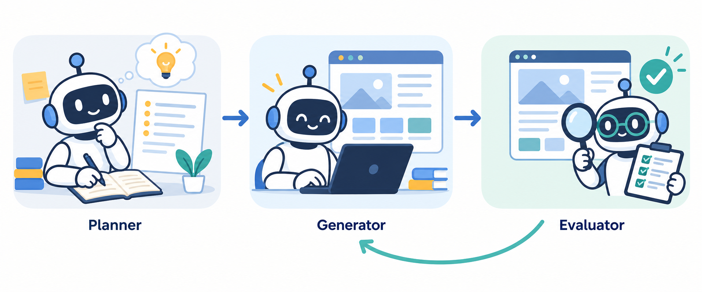

[機能の概要](index.md) ｜ [クイックスタート](setup.md) ｜ [各機能の使い方](usage.md)

# longrun-app-dev

## 機能の概要

3つのサブエージェントを使用し、仕様作成・実装・評価をそれぞれ分担します。

**Planner** が短い要求を整理し、アプリ全体の仕様を作成します。

続いて **Generator** がその仕様に沿って、既存のWebアプリを実装・修正します。

実装後は **Evaluator** が実装担当とは別の立場でアプリを操作し、機能と画面品質を評価します。

問題が見つかると評価結果を **Generator** に返し、設定した上限内で修正と再評価を繰り返します。

出典：[Anthropic — Harness design for long-running application development](https://www.anthropic.com/engineering/harness-design-long-running-apps)

## 使い始める

[クイックスタートを始める →](setup.md)
