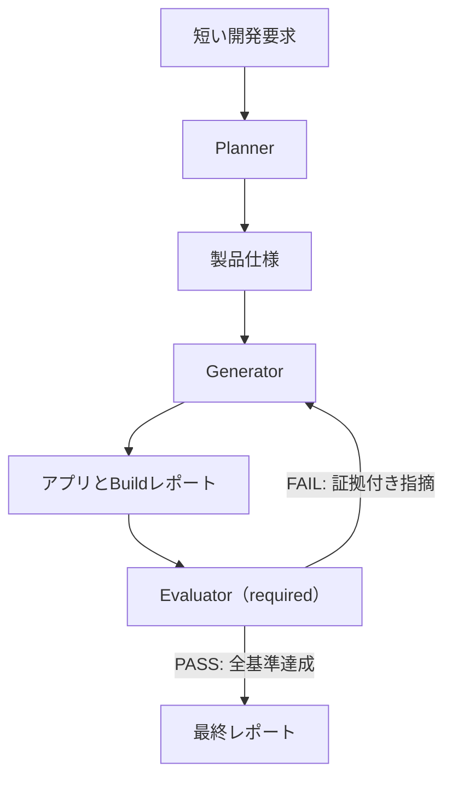
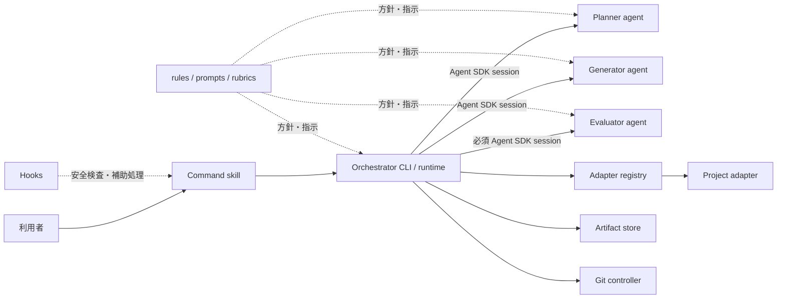
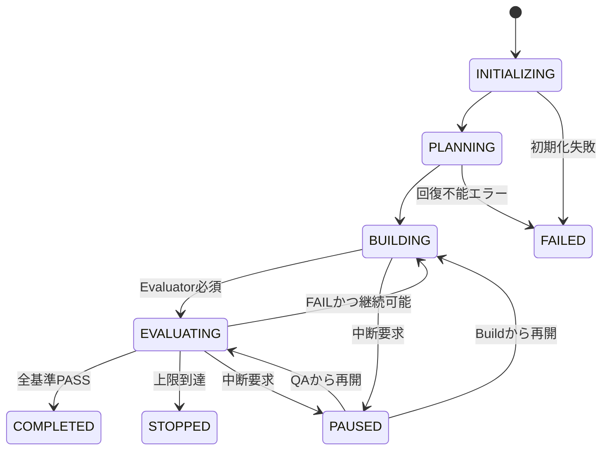

# harness-longrun-app-dev 要件定義書

| 項目 | 内容 |
| --- | --- |
| 文書番号 | HLAD-RD-001 |
| バージョン | 0.3.3 |
| 作成日 | 2026-09-02 |
| ステータス | M0要件ベースライン承認済み |
| 対象 | 長時間自律アプリケーション開発ハーネス |
| 配布形態 | GitHub公開プロジェクト／Claude Codeプラグイン |

## 1. 目的

本書は、Anthropicが公開した「[Harness design for long-running application development](https://www.anthropic.com/engineering/harness-design-long-running-apps)」の改良版ハーネスを中核として再現し、記事由来の要素と本プロジェクト独自の拡張を区別したうえで、Claude Codeから利用できる長時間アプリケーション開発基盤の要件を定義する。

ハーネスは、短い開発要求を製品仕様へ展開し、実装担当と評価担当を分離した反復ループによって、数時間規模のアプリケーション開発を自律的に進める。記事準拠の初期リリースではWebフルスタックアプリを基準実装および保証対象とし、その他の技術スタックは後続リリースで拡張する。

## 2. 設計の前提

本書は次の回答を確定事項として扱う。

- 記事中の「スプリント構造を削除した改良版」のみを実装する。
- Claude Codeプラグインを利用者の入口とし、Claude Agent SDKを実行基盤とする。
- 初期リリースの正式対象をWebフルスタック基準実装に限定する。
- 記事の三つの役割、独立評価、ハード閾値、仕様全体を対象とするBuild/QA反復を維持する。
- 初期リリースではEvaluatorの実行を必須とし、実行方式を `required` に固定する。
- 記事の初期版にあるスプリント分割とスプリント契約交渉は実装しない。
- GitHubリポジトリは `harness-longrun-app-dev` の一つだけを作成する。
- 同じリポジトリにMarketplaceカタログとPlugin本体を配置し、Marketplace専用リポジトリは作成しない。

## 3. プロジェクト名

### 3.1 採用名

**`harness-longrun-app-dev`**

採用理由は次のとおりである。

- `harness-` を先頭に置くことで、今後作成するハーネス関連リポジトリを名前順でまとめられる。
- `longrun-app-dev` により、長時間のアプリケーション開発用であることを表現できる。
- Web、モバイル、CLIなど特定の技術に限定されない。
- GitHub検索、README、GitHub Pages、プラグイン名へ展開しやすい。
- 特定企業・モデルの名称に依存せず、将来も名称を維持しやすい。

### 3.2 命名規則

| 対象 | 採用名 |
| --- | --- |
| GitHubリポジトリ | `harness-longrun-app-dev` |
| Marketplace | `harness-tools` |
| Plugin | `longrun-app-dev` |
| Skill名前空間 | `/longrun-app-dev:*` |

GitHubリポジトリだけが `harness-` で始まり、利用者が実行するPlugin名とコマンドは短い `longrun-app-dev` を使用する。

## 4. 用語

| 用語 | 定義 |
| --- | --- |
| Harness | 複数のAIエージェント、ツール、状態、成果物、実行制御を組み合わせる仕組み。 |
| Planner | 短い要求を詳細な製品仕様へ展開するエージェント。 |
| Generator | 製品仕様と評価結果に基づいてアプリケーションを実装するエージェント。 |
| Evaluator | Generatorと分離されたコンテキストで、実際の動作と品質を厳格に評価するエージェント。 |
| Build round | Generatorが新規実装または指摘修正を行う一回の実装フェーズ。コンパイルや成果物生成コマンドの有無にかかわらず実施する。 |
| QA round | Evaluatorが成果物を操作・検証し、合否と修正指示を出す一回の評価フェーズ。 |
| Project adapter | 技術スタック固有の準備、起動、ビルド、テスト、終了を共通形式へ変換する定義。 |
| `adapter.build` | Project adapterが提供する、コンパイルまたは配布可能な成果物生成のための任意操作。対象プロジェクトに対応するbuild scriptが存在する場合だけ実行する。Build roundとは別概念である。 |
| Run | 一つの利用者要求に対して、計画から終了まで行われる一連の実行。 |

## 5. 対象範囲

### 5.1 対象

- Claude Code Plugin Marketplaceからインストールできるプラグイン
- Claude Agent SDKを用いたオーケストレーター
- Planner、Generator、Evaluatorの独立した役割定義
- 製品仕様、評価結果、状態をファイルで受け渡す仕組み
- 長時間Build、独立QA、修正Buildの反復
- コンテキストの自動コンパクションを前提とした継続実行
- Gitチェックポイントおよび中断後の再開
- Webフルスタック基準実装向けProject adapter
- Webアプリ向けPlaywright MCP評価
- コスト、時間、ラウンド数による停止制御
- 実行ログ、品質スコア、最終レポート
- GitHub Actionsによる検証とリリース
- GitHub Pagesによるドキュメント公開

### 5.2 初期リリースの対象外

- スプリント分割およびスプリント契約交渉
- 複数Generatorによる同時並列実装と自動マージ
- 人間の許可を伴わない本番デプロイ
- 人間の許可を伴わないGitHub pushまたはPull Request作成
- SaaS型の中央管理画面
- 利用料金の代理請求
- Anthropic以外のモデルプロバイダー
- Web以外のCLI、API、モバイル、Java、.NET、Python、generic向けProject adapterと正式サポート

### 5.3 将来リリースで検討する実行モード

次の実行モードは初期リリースの要件・受入対象に含めず、記事準拠版の実測後に個別の要件変更として検討する。

- `adaptive`: タスクの複雑性、自己検証結果、仕様リスク、モデル能力に応じてEvaluatorの要否を判断するモード。
- `disabled`: 利用者の明示指定により独立QAを省略するモード。
- Solo: 単一Agentで計画、実装、自己検証を行う比較・低コスト向けモード。
- Standard: Planner、Generatorを使用し、条件に応じてEvaluatorを実行する中間モード。

初期リリースではこれらを設定、選択、実行できてはならない。

## 6. 記事への忠実性方針

### 6.1 必ず再現する要素

- Planner、Generator、Evaluatorの三エージェント構成
- 1〜4文程度の要求を詳細な製品仕様へ変換するPlanner
- 製品背景と高水準の技術設計を重視し、実装詳細を早期に固定し過ぎない計画
- アプリへAI機能を組み込める機会の検討
- AI機能を採用する場合、アプリ自身の機能をツール経由で操作できるAgentとして実装すること
- 一つの連続セッションで全体を構築するGenerator
- Agent SDKの自動コンパクションを使う長時間実行
- Generatorとは独立したEvaluator
- Webアプリを実際に操作するPlaywright MCP
- UI、API、データベースなど、対象アプリに存在する各層の実動作評価
- 製品の深さ、機能性、視覚設計、コード品質の評価
- 各基準のハード閾値と、一項目でも未達なら不合格とする判定
- 不合格内容をGeneratorへ戻す反復ループ
- 構造化成果物によるエージェント間の引き継ぎ
- Gitによる変更管理

### 6.2 意図的に採用しない要素

- 初期版のスプリント構造
- GeneratorとEvaluatorによるスプリント契約交渉
- スプリントごとの一機能実装
- 古いモデルを前提とした明示的コンテキストリセット

### 6.3 将来の任意技術対応で拡張する要素

記事準拠の初期リリースではWebフルスタックアプリ向けProject adapterだけを実装する。次の対応は初期リリースの実測後に追加する将来拡張である。

- Web UIでは初期リリースからPlaywright MCPを必須とする。
- APIではHTTPテスト、契約テスト、データストア検証を利用する。
- CLIでは標準入力、標準出力、終了コード、ファイル副作用を検証する。
- モバイルでは利用可能なエミュレーター、UIテスト、ビルド成果物を検証する。
- Java、.NET、Python等では各エコシステムの標準ビルド・テストを利用する。

この拡張は記事の「実際に動かして評価する」という原則を維持し、Playwrightだけをすべての対象へ無理に適用しないためのものである。

### 6.4 記事由来要件と独自拡張の区分

要件の出典は次の区分で管理する。記事の改良版で明記されていない値や運用方式を「忠実に再現」と表現してはならない。

| 区分 | 意味 |
| --- | --- |
| `ARTICLE-V2` | スプリントを削除した改良版の記事に明記された要素。 |
| `ARTICLE-V1` | 初期スプリント版の記事にのみ明記された要素。改良版へ継承する場合はその判断を明記する。 |
| `INFERRED` | 記事から合理的に導けるが、明示的には規定されていない要素。 |
| `PROJECT-EXTENSION` | 対応技術、配布、安全性、再開など本プロジェクトが追加する要素。 |

ファイルベース連携は初期版で明記された方式であり、本プロジェクトでは会話履歴への依存を避けて再開可能性を高めるため、改良版にも継承する。Gitチェックポイント、固定の費用・時間・QA回数、具体的な採点閾値は記事の規定ではなく、本プロジェクトの運用上の初期値とする。

## 7. システム構成



### 7.1 主要コンポーネント

| コンポーネント | 種別・実体 | 責務 | 想定配置 |
| --- | --- | --- | --- |
| Claude Code Plugin | 配布・統合単位 | Skill、サブエージェント定義、Hooks、実行ファイル、設定雛形を一つのPluginとして配布する。Plugin自体はAgentやOrchestratorではない。 | `plugins/longrun-app-dev/` |
| Command skills | Claude Code Skill | `/longrun-app-dev:start` などの利用者向け入口となり、引数を検証してOrchestratorのCLIを起動する。長時間Runの状態遷移そのものは担当しない。 | `plugins/longrun-app-dev/skills/*/SKILL.md` |
| Orchestrator | 決定的なランタイムプログラム | Claude Agent SDKを呼び出して各Agentセッションを開始し、状態機械、成果物の受け渡し、Evaluator実行判断、上限、再試行、中断、再開、終了を制御する。LLMのサブエージェント、Skill、rulesのいずれでもない。 | `plugins/longrun-app-dev/runtime/src/orchestrator/` および `bin/longrun-app-dev` |
| Planner | Agent定義から生成する独立Agent SDKセッション | 開発要求、既存コード、制約から製品仕様と評価可能な完成条件を作成する。RunごとにOrchestratorが起動する。 | `agents/planner.md`、`prompts/planner.md` |
| Generator | Agent定義から生成する独立Agent SDKセッション | 仕様全体を一つの継続セッションで実装し、自己検証後に成果物を引き渡す。QA後の修正Buildも担当する。 | `agents/generator.md`、`prompts/generator.md` |
| Evaluator | Agent定義から生成する独立Agent SDKセッション | Generatorと分離されたコンテキストで必ず実動作を検証し、基準別スコア、合否、証拠、修正指示を作成する。初期リリースの実行方式は `required` に固定する。 | `agents/evaluator.md`、`prompts/evaluator.md` |
| Project adapter | 技術スタック別の実行定義またはランタイムモジュール | 対象アプリの検出、準備、ビルド、起動、テスト、評価、停止を共通インターフェースへ変換する。Agentではない。 | `plugins/longrun-app-dev/adapters/` |
| Adapter registry | Orchestrator内のランタイムモジュール | 利用可能なProject adapterを列挙し、対象リポジトリに適したadapterを検出・選択する。Agentではない。 | `plugins/longrun-app-dev/runtime/src/orchestrator/` または専用 `adapters/registry` モジュール |
| Artifact store | Orchestrator内の永続化モジュールと成果物ディレクトリ | 仕様、状態、Build/QAレポート、証拠、実行メトリクスを原子的に保存・読込・検証する。外部ストレージサービスを意味しない。 | ランタイムは `runtime/src/artifacts/`、データは対象リポジトリの `.longrun-app-dev/` |
| Git controller | Orchestrator内のランタイムモジュール | Gitコマンドを安全方針の範囲で実行し、作業ブランチ、チェックポイント、差分、開始時SHA、再開時整合性を管理する。Agentではない。 | `plugins/longrun-app-dev/runtime/src/git/` |
| Hooks | Claude Code Pluginのライフサイクル処理 | 実行前後の安全検査や補助処理を行う。Run全体の状態機械やAgent間調整は担当しない。 | `plugins/longrun-app-dev/hooks/hooks.json` |
| Rules・prompts・rubrics | 宣言的な方針・指示 | Agentの役割、禁止事項、評価基準、採点例を定義する。自ら処理を起動したり状態遷移を進めたりするコンポーネントではない。 | `agents/`、`prompts/`、`rubrics/` および設定ファイル |

したがって、OrchestratorはrulesでもSkillでもサブエージェントでもない。TypeScript等で実装する通常のランタイムプログラムであり、Skillから呼び出され、Claude Agent SDKを介してPlanner、Generator、EvaluatorというAgentセッションを制御する。rules、prompts、rubricsはOrchestratorと各Agentが従う方針であり、Skillは利用者からOrchestratorへの入口である。

### 7.2 コンポーネント間の実行関係



実行の所有者はOrchestratorとする。SkillまたはHookがPlanner、Generator、Evaluatorを直接連鎖起動してRun状態を管理する実装は禁止する。これにより、CLIからの再開、原子的な状態保存、上限判定およびテスト可能な状態遷移を一か所へ集約する。

## 8. 状態遷移



### 8.1 正常終了条件

初期リリースのRunはEvaluatorを必ず実行し、次をすべて満たした場合のみ `COMPLETED` とする。

- 適用対象となるすべての評価基準が閾値以上である。
- 重大度CriticalまたはHighの未解決不具合が0件である。
- 対象に `adapter.build` が適用される場合はそれが成功し、必須テストと静的解析も成功している。
- 仕様上の主要機能にスタブ、固定表示、未接続操作が残っていない。
- Evaluatorが証拠を伴って最終PASSを記録している。

## 9. ユースケース

### UC-01 新規アプリケーションを開発する

利用者は空または雛形のGitリポジトリで短い要求を入力する。Plannerが仕様を作り、Generatorが実装し、Evaluatorが評価する。不合格の場合は修正を反復し、合格または停止条件到達時に終了する。

### UC-02 既存アプリケーションを拡張する

利用者は既存リポジトリで追加要求を入力する。ハーネスは既存構造、規約、テスト、未コミット変更を把握し、既存機能を保護しながら変更する。

### UC-03 中断したRunを再開する

利用者は端末終了、APIエラー、手動停止後に、保存された状態とGitチェックポイントからRunを再開する。

### UC-04 QAだけを再実行する

利用者は現在の成果物に対してEvaluatorだけを実行し、新しい評価レポートを得る。

### UC-05 独自Project adapterを追加する

利用者は対象技術向けの準備、起動、テスト、停止、証拠収集を定義し、ハーネスに登録する。

## 10. 機能要件

### 10.1 初期化・事前検査

- **FR-001** プラグインは対象リポジトリにハーネス設定を作成できなければならない。
- **FR-002** 対象がGitリポジトリであることを検査しなければならない。
- **FR-003** 未コミット変更、現在ブランチ、HEAD SHAを実行前に記録しなければならない。
- **FR-004** 利用者の既存変更を無断で削除、上書き、コミットしてはならない。
- **FR-005** Claude Agent SDK、認証、Git、対象ランタイム、評価ツールの利用可否を診断しなければならない。
- **FR-006** Project adapterを自動検出し、複数候補または検出不能の場合は利用者に選択を求めなければならない。
- **FR-007** 実行前に最大費用、最大時間、最大QA回数、Git操作方針を提示しなければならない。
- **FR-008** Runごとに重複しないRun IDを発行しなければならない。

### 10.2 Planner

- **FR-101** Plannerは1〜4文程度の要求から詳細な製品仕様を生成しなければならない。
- **FR-102** 仕様は製品概要、対象利用者、課題、利用シナリオ、機能、非機能要件、データ、外部連携、UX方針、制約、受入条件を含まなければならない。
- **FR-103** Plannerは製品の目的と高水準の技術設計に集中し、変更されやすい実装詳細を過度に固定してはならない。
- **FR-104** Plannerは現実的でありながら十分に意欲的な機能範囲を提案しなければならない。
- **FR-105** Plannerは有用なAI機能を組み込む機会を検討し、採用または不採用の理由を記録しなければならない。
- **FR-106** 既存アプリでは、既存アーキテクチャ、コーディング規約、依存関係、テスト方式を仕様へ反映しなければならない。
- **FR-107** 仕様を人間向けMarkdownと機械処理向けJSONの両方で保存しなければならない。
- **FR-108** 仕様生成後、矛盾、不明確な完了条件、検証不能な要求を自己検査しなければならない。
- **FR-109** AI機能を採用する場合、Plannerは自然言語指示で実行する利用者タスク、Agentが利用するアプリ内ツール、期待される状態変化、評価可能な完了条件を仕様に含めなければならない。

### 10.3 Generator

- **FR-201** Generatorはスプリントへ分割せず、製品仕様全体を対象に連続したBuildセッションを実行しなければならない。
- **FR-202** Generatorは対象リポジトリ内で必要なファイル作成、編集、依存導入、ビルド、テストを実行できなければならない。
- **FR-203** Generatorは既存の開発規約とProject adapterのコマンドに従わなければならない。
- **FR-204** GeneratorはEvaluatorへ渡す前に、対象にbuild scriptが存在する場合だけ `adapter.build` を実行し、加えてテスト、静的解析、主要動作の自己検証を実行しなければならない。`adapter.build` が非適用でもBuild round自体は必ず実施する。
- **FR-205** TODO、固定表示、未接続ボタン、モックだけの本番処理、空実装を完成として扱ってはならない。
- **FR-206** 各Build roundで実装内容、変更ファイル、検証結果、既知の課題をBuildレポートへ記録しなければならない。
- **FR-207** 2回目以降は各QA指摘を未対応、対応済み、再現不能、設計変更のいずれかで追跡しなければならない。
- **FR-208** スコアが停滞または低下した場合、現方針の改善か大きな設計変更かを判断し、その理由を記録しなければならない。
- **FR-209** 各Build round終了時に設定に従ってGitチェックポイントを作成しなければならない。
- **FR-210** 利用者の許可なしにpush、force-push、タグ作成、リリース、デプロイを実行してはならない。
- **FR-211** AI機能を採用する場合、Generatorは表示上のチャット機能だけで完成とせず、アプリの中核機能を呼び出すツールをAgentへ提供しなければならない。
- **FR-212** AI Agentがツールを使用してアプリの実状態を変更し、仕様で定めた利用者タスクを端から端まで完了できるよう実装しなければならない。
- **FR-213** 各Build roundは一つの継続したGeneratorセッションとして実行し、自動コンパクションの前後で同じセッションを維持しなければならない。QA後の修正は新しいBuild roundとして開始してよい。

### 10.4 Evaluator

- **FR-301** EvaluatorはGeneratorとは別のエージェント、別プロンプト、独立した評価コンテキストで実行しなければならない。
- **FR-302** Evaluatorはコードだけを読んで合格にせず、対象アプリを起動して実際の振る舞いを検証しなければならない。
- **FR-303** Web UIを持つアプリではPlaywright MCPによる操作、スクリーンショット、画面状態確認を必須としなければならない。
- **FR-304** Webアプリでは、UIに加えてAPI、データベース、外部サービスなど実際に存在する各層について、観測可能な状態と副作用の整合性を確認しなければならない。存在しない層の検証は要求しない。
- **FR-306** 正常系だけでなく、異常系、境界値、永続化、再起動、回帰、主要な連続操作を検証しなければならない。
- **FR-307** 製品の深さ、機能性、視覚設計、コード品質を基準別に採点しなければならない。
- **FR-308** UIを持たない対象では視覚設計をN/Aにできるが、その理由を必須とし、他の基準を緩和してはならない。
- **FR-309** 一つでも適用基準がハード閾値未満の場合、QA round全体をFAILにしなければならない。
- **FR-310** Evaluatorは検出した問題を自ら軽微として無視せず、仕様からの逸脱を厳格に判定しなければならない。
- **FR-311** FAILごとに再現手順、期待結果、実結果、証拠、重大度、関連する仕様項目を記録しなければならない。
- **FR-312** UI評価ではデザイン品質、独自性、技術的完成度、操作性を詳細に評価しなければならない。
- **FR-313** 評価の一貫性を保つため、基準別のfew-shot採点例をバージョン管理しなければならない。
- **FR-314** QAレポートを人間向けMarkdownと機械処理向けJSONの両方で保存しなければならない。
- **FR-315** AI Agentを含むアプリでは、Evaluatorは自然言語指示からAgentがアプリ内ツールを選択・実行し、中核タスクと期待される状態変化を完了できることを検証しなければならない。

### 10.5 反復・終了制御

- **FR-401** Orchestratorは `INITIALIZE → PLAN → BUILD → QA` の順で処理し、初期リリースではQAを省略してはならない。
- **FR-402** QAがFAILの場合、QAレポートを次のGenerator入力にして `BUILD → QA` を反復しなければならない。
- **FR-403** 初期リリースのRunはEvaluatorによるQAが全基準PASSの場合のみ正常終了しなければならない。
- **FR-404** 最大QA回数を設定可能とし、本プロジェクトの暫定初期値を3回としなければならない。この値を記事由来の推奨値として扱ってはならない。
- **FR-405** 最大費用、最大実行時間、最大API失敗回数を設定可能としなければならない。
- **FR-406** 上限到達時は最新状態と未解決事項を保存してSTOPPEDで終了しなければならない。
- **FR-407** 手動停止要求を受けた場合、可能な限り安全なフェーズ境界で停止しなければならない。
- **FR-408** 成功、品質未達、費用超過、時間超過、手動停止、回復不能エラーを終了理由として区別しなければならない。
- **FR-409** 初期リリースではEvaluatorの実行方式を `required` に固定し、利用者設定による変更またはQA省略を許可してはならない。
- **FR-412** QAは仕様全体のBuild完了後に一括して実行し、機能単位のスプリント、スプリント契約またはスプリントごとの中間採点を導入してはならない。FAIL後は仕様全体を対象とする次のBuild roundへ移行しなければならない。

### 10.6 状態・成果物・再開

- **FR-501** Run状態を対象リポジトリ内の機械可読ファイルへ保存しなければならない。
- **FR-502** 状態はRun ID、フェーズ、QA回数、開始時刻、最新成果物、Git SHA、消費量、終了理由を含まなければならない。
- **FR-503** 状態更新は原子的に行い、書き込み途中の破損を防がなければならない。
- **FR-504** エージェント間の主要な引き継ぎは会話履歴だけに依存せず、保存済み成果物を正としなければならない。
- **FR-505** 中断したRunを最後に完了した安全な境界から再開できなければならない。
- **FR-506** 再開時に保存済みGit SHAと現在のGit SHAを比較し、差異がある場合は無断で継続してはならない。
- **FR-507** 状態または必須成果物が破損・欠落している場合、復旧可否と必要操作を表示しなければならない。
- **FR-508** 同一リポジトリに対する競合Runをロックによって防止しなければならない。

### 10.7 利用者向けコマンド

| コマンド | 機能 |
| --- | --- |
| `/longrun-app-dev:init` | 設定、成果物ディレクトリ、Project adapterを初期化する。 |
| `/longrun-app-dev:start` | 新しいRunを開始する。 |
| `/longrun-app-dev:resume` | 中断したRunを再開する。 |
| `/longrun-app-dev:status` | 現在フェーズ、QA回数、費用、時間、直近結果を表示する。 |
| `/longrun-app-dev:evaluate` | 現在の成果物に対してEvaluatorだけを実行する。 |
| `/longrun-app-dev:stop` | 実行中Runへ停止要求を送る。 |
| `/longrun-app-dev:doctor` | 認証、SDK、Git、ランタイム、評価ツールを診断する。 |
| `/longrun-app-dev:clean` | 完了済みRunの一時データを安全に整理する。 |

### 10.8 将来機能要件（初期リリース対象外）

- **FUT-FR-001** `adaptive` を追加する場合は、タスクの複雑性、未経験の技術、自己検証結果、仕様のリスクおよびモデル能力に基づいてEvaluatorの要否を判断し、その入力と理由を保存しなければならない。自己検証失敗、未解決事項、主要機能の未検証が一つでもある場合はEvaluatorを省略してはならない。
- **FUT-FR-002** `disabled` を追加する場合は、利用者が明示的に指定した場合だけ許可し、独立QA未実施を最終レポートへ明記しなければならない。
- **FUT-FR-003** Solo、Standardを追加する場合は、各モードのAgent構成、品質ゲート、利用条件、費用・時間計測方法を、初期Runの実測結果に基づいて定義しなければならない。
- **FUT-FR-004** Web以外の対象を追加する場合は、Project adapterが定義する実動作テストと証拠収集を実行しなければならない。

## 11. Project adapter要件

### 11.1 共通インターフェース

各Project adapterは最低限次を定義する。

| 項目 | 内容 |
| --- | --- |
| detect | 対象技術スタックか判定する。 |
| prerequisites | 必要ランタイム、ツール、外部サービスを検査する。 |
| setup | 依存関係導入などの準備を行う。 |
| `adapter.build` | 対応するbuild scriptが存在する場合だけ、コンパイルまたは成果物生成を行う。 |
| start | 評価対象を起動し、ready状態を判定する。 |
| test | 自動テストを実行する。 |
| lint | 静的解析、型検査、フォーマット検査を実行する。 |
| evaluate | 技術固有の実動作評価と証拠収集を行う。 |
| stop | 起動したプロセス、コンテナ、エミュレーターを終了する。 |

### 11.2 初期リリースの標準adapter

- Webフルスタック：`package.json` とpackage scriptsを検出し、Playwright MCPによるUI操作、HTTP検証、および実在するデータストアの検証を行う。

Node.js CLI、Python、Java、.NET、Android、generic adapterは後続リリースの対象とする。

### 11.3 自動検出例

| 検出ファイル | 候補adapter |
| --- | --- |
| `package.json` | Webフルスタック |

その他の検出規則は対応する将来adapterの要件確定時に追加する。

## 12. 評価要件

### 12.1 共通ルーブリック

| 基準 | 確認内容 | 本プロジェクトの暫定初期閾値 |
| --- | --- | --- |
| Product depth | 中核機能が表示だけでなく十分な操作・状態・連携を備え、主要仕様が欠落していないか。 | 8/10 |
| Functionality | 利用者が主要タスクを完了でき、正常系、異常系、永続化、連携が実際に動くか。 | 8/10 |
| Visual design | UIが一貫した意図、独自性、分かりやすい階層、適切な余白・色・操作性を備えるか。 | 8/10またはN/A |
| Code quality | 構造、可読性、型安全性、テスト、エラー処理、セキュリティ、保守性が十分か。 | 8/10 |

記事は基準ごとのハード閾値を要求しているが、具体的な数値は公開していない。上表の `8/10` は本プロジェクトの校正前の暫定値であり、記事由来の推奨値ではない。平均点で未達基準を相殺してはならない。

### 12.2 Web UIの詳細評価

- **Design quality:** 色、文字、余白、レイアウト、画像、動きが一つの製品体験として統合されていること。
- **Originality:** ライブラリ既定値、テンプレート、典型的なAI生成パターンに依存せず、製品固有の判断が見えること。
- **Craft:** 文字階層、整列、間隔、色調和、コントラスト、レスポンシブ表示などの基礎が崩れていないこと。
- **Functionality:** 利用者が主操作を理解し、迷わず完了でき、画面と実処理が正しく接続されていること。

Web UIでは記事の方針に従い、Design qualityとOriginalityを重点基準とする。ただし重点化はCraftまたはFunctionalityのハード閾値を緩和せず、すべての適用基準が個別に閾値を満たすことを要求する。

### 12.3 証拠要件

Evaluatorは可能な範囲で次を保存する。

- 実行したテストコマンドと終了コード
- 操作手順と観測結果
- Web UIのスクリーンショット
- API要求・応答の要約
- データベース状態の検証結果
- エラーログの関連部分
- 該当する仕様IDとソースコード位置

## 13. 設定要件

対象リポジトリの `.longrun-app-dev/config.yaml` を正本とする。

```yaml
schemaVersion: 1

models:
  planner: "<model-id>"
  generator: "<model-id>"
  evaluator: "<model-id>"

evaluation:
  mode: required

limits:
  maxQaRounds: 3
  maxDurationMinutes: 240
  maxCostUsd: 150
  maxConsecutiveErrors: 3

quality:
  thresholds:
    productDepth: 8
    functionality: 8
    visualDesign: 8
    codeQuality: 8

adapter:
  type: auto
  setup: ""
  build: ""
  start: ""
  test: ""
  lint: ""
  stop: ""

git:
  workBranchPrefix: "longrun-app-dev/"
  commitEachBuildRound: true
  allowPush: false

logging:
  saveFullPrompts: false
  saveFullResponses: false
```

正式モデルIDは設定値とし、特定モデル名をコードへ固定しない。
初期リリースの `evaluation.mode` はschemaで `required` の定数として検証し、他の値を受理しない。
`maxQaRounds: 3` と各 `8` の閾値は本プロジェクトの暫定初期値であり、記事が規定する値ではない。

## 14. 成果物要件

### 14.1 対象リポジトリ内の成果物

「対象リポジトリ」とは、ハーネス本体の `harness-longrun-app-dev` リポジトリではなく、ハーネスを使用して作成または変更するアプリケーションのGitリポジトリを指す。「対象リポジトリ内の成果物」とは、そのリポジトリ内の `.longrun-app-dev/` にハーネスが生成・保存する設定、実行状態、Agent間引き継ぎ、評価証拠および最終報告を指す。開発対象アプリケーションのソースコードやビルド成果物そのものは、この用語には含めない。

このディレクトリを対象リポジトリ内に置く目的は次のとおりである。

- Planner、Generator、Evaluatorが会話履歴だけに依存せず情報を引き継ぐ。
- Orchestratorが中断後に安全なフェーズ境界からRunを再開する。
- 利用者が、何を要求し、実装し、検証し、どの理由で終了したか確認する。
- Run時点のGit状態と成果物を関連付ける。

```text
.longrun-app-dev/
├── .gitignore
├── config.yaml
├── state.json
├── active-run.lock
├── runs/
│   └── <run-id>/
│       ├── request.md
│       ├── product-spec.md
│       ├── product-spec.json
│       ├── build/
│       │   ├── round-01.md
│       │   └── round-02.md
│       ├── qa/
│       │   ├── round-01.md
│       │   ├── round-01.json
│       │   └── evidence/
│       ├── logs/
│       │   └── events.jsonl
│       └── final-report.md
└── adapters/
    └── custom.yaml
```

| 成果物 | 作成・更新主体 | 用途 |
| --- | --- | --- |
| `.gitignore` | `init` / Orchestrator | 実行時だけ必要な状態、lock、ログ、証拠の既定Git除外を定義する。 |
| `config.yaml` | `init`、利用者 | 対象リポジトリにおけるモデル、上限、adapter、Git、ログ方針の正本。 |
| `state.json` | Orchestrator | 現在のphase、round、Git SHA、消費量、終了理由など、再開に必要な最新状態。 |
| `active-run.lock` | Orchestrator | 同じ対象リポジトリで競合Runが起動することを防ぐ一時lock。 |
| `request.md` | Orchestrator | Run開始時に確定した利用者要求。 |
| `product-spec.md` | Planner | 利用者が読む製品仕様。 |
| `product-spec.json` | Planner、Orchestrator | Generator、Evaluatorおよび状態機械が参照する構造化製品仕様。 |
| `build/round-*.md` | Generator | roundごとの変更内容、検証結果、QA指摘への対応状況、既知の課題。 |
| `qa/round-*.md` | Evaluator | 利用者およびGeneratorが読む評価、問題、修正指示。 |
| `qa/round-*.json` | Evaluator、Orchestrator | 基準別スコア、PASS/FAIL、問題一覧を含む構造化評価結果。 |
| `qa/evidence/` | Evaluator | スクリーンショットなど、評価結果を裏付ける証拠。 |
| `logs/events.jsonl` | Orchestrator | phase、Agent、時刻、費用、再試行、状態遷移を含む機械可読イベントログ。 |
| `final-report.md` | Orchestrator | 最終状態、仕様充足状況、未解決事項、費用、時間、round履歴の要約。 |
| `adapters/custom.yaml` | 利用者、`init` | 標準adapterで扱えない対象固有の安全な実行設定。 |

### 14.2 成果物の管理

- Run成果物はRun IDごとに分離する。
- JSON成果物はJSON Schemaで検証する。
- ログは時刻、フェーズ、エージェント、イベント、消費量を含む。
- シークレット、アクセストークン、個人情報を成果物へ保存しない。
- 大容量スクリーンショットやログの保持期間を設定可能とする。

### 14.3 Git管理方針

成果物は、再現性のため共有するものと、実行環境にだけ保持するものを分離する。

| 区分 | 対象 | 既定方針 |
| --- | --- | --- |
| 共有設定 | `config.yaml`、`.gitignore`、`adapters/custom.yaml` | Git管理対象とする。ただし環境固有の絶対パスやシークレットを含めてはならない。 |
| 共有可能な記録 | `request.md`、`product-spec.*`、`build/*.md`、`qa/round-*.md`、`qa/round-*.json`、`final-report.md` | 既定ではGit管理対象とし、チームで要求、判断、評価を追跡可能にする。利用者は設定で除外へ変更できる。 |
| 実行時状態 | `state.json`、`active-run.lock` | `.longrun-app-dev/.gitignore` で必ず除外する。 |
| 大容量・一時記録 | `logs/`、`qa/evidence/` | 既定では `.longrun-app-dev/.gitignore` で除外する。明示的な設定により必要な証拠だけ管理対象へ変更できる。 |
| 機密情報 | APIキー、token、password、cookie、秘密鍵、認証済みsession、個人情報 | 保存およびGit追加を禁止する。ignoreだけを保護手段としてはならない。 |

`init` は `.longrun-app-dev/.gitignore` を作成し、少なくとも次を除外しなければならない。

```gitignore
/state.json
/active-run.lock
/runs/*/logs/
/runs/*/qa/evidence/
```

- Orchestratorは成果物を書き込む前にシークレットをマスクし、保存禁止情報を検出した場合は保存を中止して安全なエラーを返す。
- `config.yaml` と `adapters/custom.yaml` にはシークレットの値を直接記載せず、環境変数名または安全な認証参照だけを記載する。
- 利用者の要求または仕様に機密情報や個人情報が含まれる可能性がある場合、共有可能な記録もGit除外へ切り替えられなければならない。
- `clean` は保持期間を過ぎたログ、証拠および完了Runの一時状態だけを対象とし、共有設定、仕様、最終レポートを既定で削除してはならない。
- ハーネスは対象リポジトリの既存 `.gitignore` を無断で置換してはならない。

## 15. プラグイン配布要件

### 15.1 識別子

| 種別 | 値 |
| --- | --- |
| GitHubリポジトリ | `<github-owner>/harness-longrun-app-dev` |
| Marketplace名 | `harness-tools` |
| Plugin名 | `longrun-app-dev` |
| Skill名前空間 | `/longrun-app-dev:*` |

### 15.2 インストール方法

Claude Code内から次のコマンドでインストールできなければならない。

```text
/plugin marketplace add <github-owner>/harness-longrun-app-dev
/plugin install longrun-app-dev@harness-tools
```

非対話CLIも提供する。

```bash
claude plugin marketplace add <github-owner>/harness-longrun-app-dev
claude plugin install longrun-app-dev@harness-tools
```

### 15.3 単一リポジトリ方針

MarketplaceとPlugin本体は同じGitHubリポジトリに配置する。利用者がMarketplaceとして追加するリポジトリと、Pluginのソースを取得するリポジトリは、どちらも `harness-longrun-app-dev` とする。

- リポジトリ直下の `.claude-plugin/marketplace.json` がMarketplaceカタログとなる。
- `marketplace.json` のPlugin sourceには `./plugins/longrun-app-dev` を指定する。
- Plugin本体は `plugins/longrun-app-dev/` 配下だけで完結させる。
- Pluginインストール時にPluginディレクトリだけがキャッシュへコピーされても動作できるよう、Plugin外部のファイルへ依存しない。
- 将来Pluginが複数に増えた場合も、当面は同じ `plugins/` 配下へ追加できる構造とする。
- Marketplace専用の `harness-marketplace` リポジトリは初期リリースでは作成しない。

### 15.4 リポジトリのディレクトリ構成

```text
harness-longrun-app-dev/
├── .claude-plugin/
│   └── marketplace.json
├── .devcontainer/
│   └── devcontainer.json
├── .github/
│   ├── ISSUE_TEMPLATE/
│   ├── pull_request_template.md
│   └── workflows/
│       ├── ci.yml
│       ├── plugin-e2e.yml
│       ├── docs.yml
│       └── release.yml
├── plugins/
│   └── longrun-app-dev/
│       ├── .claude-plugin/
│       │   └── plugin.json
│       ├── skills/
│       │   ├── init/SKILL.md
│       │   ├── start/SKILL.md
│       │   ├── resume/SKILL.md
│       │   ├── status/SKILL.md
│       │   ├── evaluate/SKILL.md
│       │   ├── stop/SKILL.md
│       │   ├── doctor/SKILL.md
│       │   └── clean/SKILL.md
│       ├── agents/
│       │   ├── planner.md
│       │   ├── generator.md
│       │   └── evaluator.md
│       ├── hooks/
│       │   └── hooks.json
│       ├── bin/
│       │   └── longrun-app-dev
│       ├── runtime/
│       │   ├── src/
│       │   │   ├── orchestrator/
│       │   │   ├── state/
│       │   │   ├── artifacts/
│       │   │   ├── git/
│       │   │   └── logging/
│       │   └── dist/
│       ├── adapters/
│       │   └── web/
│       ├── prompts/
│       │   ├── planner.md
│       │   ├── generator.md
│       │   └── evaluator.md
│       ├── rubrics/
│       │   ├── common.yaml
│       │   └── web-ui.yaml
│       ├── schemas/
│       │   ├── config.schema.json
│       │   ├── state.schema.json
│       │   ├── product-spec.schema.json
│       │   └── qa-result.schema.json
│       ├── templates/
│       │   └── project-config.yaml
│       ├── tests/
│       └── package.json
├── docs/
│   ├── .vitepress/
│   │   └── config.ts
│   ├── index.md
│   ├── getting-started.md
│   ├── architecture.md
│   ├── configuration.md
│   ├── commands.md
│   ├── adapters.md
│   ├── evaluation.md
│   ├── security.md
│   └── troubleshooting.md
├── examples/
│   └── web-app/
├── tests/
│   ├── integration/
│   └── e2e/
├── scripts/
│   ├── build-plugin.mjs
│   ├── validate-plugin.mjs
│   └── smoke-install.mjs
├── .gitignore
├── package.json
├── pnpm-lock.yaml
├── pnpm-workspace.yaml
├── tsconfig.json
├── README.md
├── CHANGELOG.md
├── CONTRIBUTING.md
└── LICENSE
```

### 15.5 主要ディレクトリの役割

| パス | 役割 |
| --- | --- |
| `.claude-plugin/marketplace.json` | `harness-tools` Marketplaceと、同一リポジトリ内のPlugin sourceを定義する。 |
| `plugins/longrun-app-dev/` | インストール対象となる自己完結したPlugin本体。 |
| `plugins/longrun-app-dev/skills/` | 利用者が呼び出す各Claude Codeスキルを格納する。 |
| `plugins/longrun-app-dev/agents/` | Planner、Generator、EvaluatorのPluginサブエージェント定義を格納する。 |
| `plugins/longrun-app-dev/runtime/` | Agent SDKオーケストレーター、状態管理、ログ、Git制御の実装を格納する。 |
| `plugins/longrun-app-dev/adapters/` | 技術スタック別の検出、準備、ビルド、起動、評価、停止処理を格納する。 |
| `plugins/longrun-app-dev/prompts/` | 三エージェントのversion管理されたプロンプトを格納する。 |
| `plugins/longrun-app-dev/rubrics/` | 共通およびUI向けの評価基準とハード閾値を格納する。 |
| `plugins/longrun-app-dev/schemas/` | 設定、状態、製品仕様、QA結果のJSON Schemaを格納する。 |
| `docs/` | VitePressでGitHub Pagesへ公開する利用者・開発者ドキュメント。 |
| `examples/` | 各技術スタックのサンプルプロジェクトと動作確認用fixture。 |
| `tests/` | リポジトリ横断の統合テストとインストールE2Eテスト。 |
| `.github/workflows/` | CI、Plugin E2E、GitHub Pages、Releaseの自動化。 |
| `scripts/` | Pluginビルド、構造検証、スモークインストール用スクリプト。 |

### 15.6 Marketplace定義要件

`.claude-plugin/marketplace.json` は少なくとも次の関係を定義する。

```json
{
  "name": "harness-tools",
  "owner": {
    "name": "<owner-name>"
  },
  "plugins": [
    {
      "name": "longrun-app-dev",
      "source": "./plugins/longrun-app-dev",
      "description": "Long-running autonomous application development harness"
    }
  ]
}
```

### 15.7 配布・更新

- `.claude-plugin/marketplace.json` にMarketplace名、所有者、Plugin名、相対sourceを定義する。
- `plugins/longrun-app-dev/.claude-plugin/plugin.json` にPlugin情報とversionを定義する。
- Pluginのインストールキャッシュ外を相対パスで参照しない。
- Semantic Versioningを採用する。
- `claude plugin validate .` をCIで実行する。
- ローカルMarketplace、GitHub Marketplace、更新、アンインストールをE2Eテストする。
- Pluginは実行可能コードを含む高信頼コンポーネントであることをREADMEに明記する。

## 16. GitHub Pages要件

### 16.1 公開方式

- Markdownをドキュメントの正本とする。
- 静的サイトジェネレーターはVitePressを第一候補とする。
- GitHub Actionsでビルドし、GitHub Pagesへ公開する。
- `main` ブランチのドキュメント変更時に自動公開する。
- Pull Requestではビルド、リンク、コード例を検証するが公開しない。
- 公開URLは `https://<github-owner>.github.io/harness-longrun-app-dev/` を基本とする。

### 16.2 必須ページ

- プロジェクト概要
- Anthropic記事との対応表
- アーキテクチャと状態遷移
- 5分で始めるクイックスタート
- Claude Code Pluginのインストール、更新、アンインストール
- Claude Agent SDKとAPI認証の準備
- コマンドリファレンス
- 設定リファレンス
- Planner、Generator、Evaluatorの役割
- 評価ルーブリックとfew-shot例
- Project adapter一覧と作成方法
- 成果物、ログ、中断、再開
- 費用・時間・QA回数の管理
- Gitと安全な作業方法
- セキュリティとシークレット管理
- トラブルシューティング
- コントリビューションガイド
- バージョン互換表と変更履歴

### 16.3 品質

- PC、タブレット、スマートフォンで閲覧できる。
- 初期言語は日本語とし、将来の英語追加が可能な構成とする。
- コマンドはコピー可能なコードブロックで提示する。
- 状態遷移と主要構成はMermaid図で提示する。
- リンク切れ、Markdown lint、サイトビルドをCIで検査する。
- 対応Claude Code version、Agent SDK version、Node.js versionを明記する。

## 17. 非機能要件

### 17.1 信頼性

- **NFR-001** フェーズ境界ごとに再開可能な状態を保存する。
- **NFR-002** 一時的なAPI失敗は指数バックオフで再試行し、上限後は安全に停止する。
- **NFR-003** Orchestratorの異常終了後も、最後に確定した成果物とGit状態を失わない。
- **NFR-004** ハーネス自身の再実行が利用者の既存変更を破壊しない。

### 17.2 セキュリティ

- **NFR-101** APIキーを環境変数または対応する安全な認証手段から取得する。
- **NFR-102** APIキー、トークン、パスワードをログ、プロンプト成果物、Gitへ保存しない。
- **NFR-103** デプロイ、外部送信、課金、DB破壊操作、Git pushを既定で禁止する。
- **NFR-104** ツール実行は最小権限と対象リポジトリ境界を原則とする。
- **NFR-105** 依存関係をロックし、脆弱性検査と自動更新通知を行う。

### 17.3 可観測性

- **NFR-201** フェーズ、開始・終了時刻、モデル、トークン、費用、再試行を記録する。
- **NFR-202** 人間向け進捗表示とJSON Lines形式の機械可読ログを提供する。
- **NFR-203** 利用者はstatusコマンドで現在フェーズと次の処理を確認できる。
- **NFR-204** 完全なプロンプト・応答保存は既定で無効とし、利用者が明示的に有効化できる。

### 17.4 性能・費用

- **NFR-301** 最大費用、最大時間、最大QA回数をハード上限として扱う。
- **NFR-302** 費用上限の80%到達時に警告する。
- **NFR-303** 不要なファイル全文再読込を避け、差分と構造化成果物を優先する。
- **NFR-304** ハーネスの時間・費用を単独Agent実行と比較できるメトリクスを保持する。

### 17.5 互換性・移植性

- **NFR-401** Linux、macOS、Windows 11上のWSL2をサポートする。
- **NFR-402** Dev Containersで再現可能な開発環境を提供する。
- **NFR-403** Claude CodeとClaude Agent SDKの最小・検証済みversionを明記する。
- **NFR-404** Node.jsのActive LTSを標準ランタイム候補とし、実装言語は基本設計で確定する。
- **NFR-405** Project adapterをハーネス本体から独立して追加できる。
- **NFR-406** Build roundはClaude Agent SDKの自動コンパクションを有効にした単一の継続セッションとして実行し、コンパクション発生後も仕様、作業状態、未完了事項を維持できなければならない。

### 17.6 保守性

- **NFR-501** Planner、Generator、Evaluatorのプロンプトを独立してversion管理する。
- **NFR-502** 評価ルーブリックとfew-shot例をコード変更なしで更新できる。
- **NFR-503** モデル進化に応じ、各構成要素を個別に有効・無効化して比較できる。
- **NFR-504** 公開API、設定schema、成果物schemaの互換性方針を定義する。

## 18. Git・CI/CD・リリース要件

### 18.1 Git運用

- `main` を保護し、Pull Request経由で変更する。
- ハーネス自身の開発はfeature branchを利用する。
- ハーネスが対象アプリを変更する場合は専用作業ブランチを作成する。
- force-pushと履歴書き換えを既定で禁止する。
- CommitにはRun IDとBuild roundを関連付ける。

### 18.2 Pull Request検証

- Plugin／Marketplace schema検証
- 型検査、lint、format
- 単体テスト、統合テスト
- サンプルProject adapterテスト
- 成果物JSON Schemaテスト
- シークレット検査、依存脆弱性検査
- GitHub Pagesビルド、リンク検査

### 18.3 リリース

- Semantic Versioningを採用する。
- Git tag、GitHub Release、CHANGELOGを作成する。
- Plugin manifest、Marketplace、tagのversion整合性を検査する。
- クリーン環境でMarketplace追加、Pluginインストール、doctor実行をスモークテストする。
- 破壊的変更には移行ガイドを付ける。

## 19. テスト要件

### 19.1 単体テスト

- 状態遷移
- 設定とschema検証
- 評価スコアとPASS/FAIL計算
- 費用、時間、QA回数の停止判定
- 状態ファイルの原子更新
- Project adapter検出
- シークレットのマスク

### 19.2 統合テスト

- Agent SDKをモックしたPLAN → BUILD → QAループ
- FAILから再Buildへの反復
- 一時的API失敗と再試行
- Run中断と再開
- Git未コミット変更の保護
- Adapterによる起動、ready判定、評価、終了

### 19.3 E2Eテスト

- ローカルMarketplaceからのPluginインストール
- GitHubからのMarketplace追加とPluginインストール
- 小規模WebアプリでのPlaywright評価
- 意図的なスタブと主要不具合の検出
- QA指摘後の修正と再評価
- 費用、時間、QA回数、手動停止による安全終了
- GitHub Pages公開成果物の確認

## 20. 受入条件

- **AC-001** 単一のGitHubリポジトリ `harness-longrun-app-dev` から、指定の2コマンドでMarketplace追加とPluginインストールが成功する。
- **AC-002** `/longrun-app-dev:start` が短い要求から製品仕様を生成する。
- **AC-003** Planner、Generator、Evaluatorが独立した役割として定義され、初期リリースのすべてのRunでGeneratorと分離された評価コンテキストが使用される。
- **AC-004** スプリントを作成せず、初期リリースのすべてのRunで仕様全体を対象とする長時間Buildと独立QAを反復する。
- **AC-005** エージェント間の主要情報が構造化ファイルで引き継がれる。
- **AC-006** 初期リリースのRunは、一基準でも閾値未満の場合に正常終了しない。
- **AC-007** 初期リリースのRunでは、意図的な未実装、未接続操作、主要不具合をEvaluatorが証拠付きで検出する。
- **AC-008** QA指摘を受けたGeneratorが修正し、次のQAで状態が更新される。
- **AC-009** Web UIをEvaluatorで評価する場合、Playwright MCPによる操作評価が実行される。
- **AC-010** Webフルスタック基準実装のProject adapterで、準備、条件付き `adapter.build`、起動、Playwright QA、テスト、停止が動作する。
- **AC-011** 最大費用、最大時間、最大QA回数、手動停止の各条件で安全に停止する。
- **AC-012** 異常終了後に保存状態から再開できる。
- **AC-013** 利用者の既存未コミット変更が失われない。
- **AC-014** GitHub Actionsの全検証が成功する。
- **AC-015** GitHub Pagesで必須ドキュメントが公開される。
- **AC-016** AI機能を採用したサンプルで、Agentがアプリ内ツールを用いて中核タスクを端から端まで完了し、その状態変化をEvaluatorが確認できる。
- **AC-017** 一つのBuild roundが自動コンパクションを挟んでも同じGeneratorセッションで継続し、仕様全体を構築できる。

### 20.1 将来受入条件（初期リリース対象外）

- **FUT-AC-001** `adaptive` でEvaluatorを省略した場合も三つの役割定義は保持され、判定根拠と独立QA未実施が最終レポートに記録される。
- **FUT-AC-002** `required`、`adaptive`、`disabled` の各モードが仕様どおり動作し、`adaptive` の判断根拠が保存される。
- **FUT-AC-003** Solo、Standardの各モードが定義済みのAgent構成と品質ゲートに従い、Full相当の初期リリースと品質、費用、時間を比較できる。

## 21. リスクと対策

| リスク | 影響 | 対策 |
| --- | --- | --- |
| 長時間実行によりAPI費用が増える | 想定外の支出 | 費用上限、80%警告、QA回数上限、フェーズ別費用表示を必須にする。 |
| Evaluatorが甘く判定する | 未完成成果物を合格にする | 独立コンテキスト、ハード閾値、証拠必須、few-shot校正、回帰fixtureを使用する。 |
| 将来の任意技術対応で評価品質に差が出る | 技術ごとの検証漏れ | 初期版のWeb adapterで共通契約を検証し、後続adapter追加時に必須証拠と適合テストを整備する。 |
| 自律実行が利用者環境を変更する | データ損失、外部影響 | Git保護、最小権限、対象境界、危険操作の既定禁止を実施する。 |
| 長時間セッションが一貫性を失う | 仕様逸脱、早期終了 | 構造化成果物、状態保存、自動コンパクション、独立QAを用いる。 |
| モデル性能向上で構成が過剰になる | 不要な費用と複雑性 | 構成要素ごとの比較機能とベンチマークを保持する。 |
| Claude Code Plugin仕様が変わる | インストール不能 | 互換表、CIでの最新版検証、version固定、移行手順を用意する。 |

## 22. トレーサビリティ

| 記事の要素 | 区分 | 対応要件 | 対応方針 |
| --- | --- | --- | --- |
| Planner、Generator、Evaluatorの三役割 | `ARTICLE-V2` | FR-101〜109、FR-201〜213、FR-301〜315 | 初期リリースでは三役割を必須として改良版を再現する。 |
| 1〜4文から製品仕様を生成 | `ARTICLE-V2` | FR-101〜109 | 改良版を再現。 |
| スプリントなしの連続した長時間Build | `ARTICLE-V2` | FR-201、FR-213、FR-412、NFR-406 | 改良版を再現。 |
| Agent SDKの自動コンパクション | `ARTICLE-V2` | FR-213、NFR-406、AC-017 | 改良版を再現。 |
| Evaluatorの適応的な要否判断 | `ARTICLE-V2` | FUT-FR-001〜002、FUT-AC-001〜002 | 初期リリースの実測後に検討する将来要件として保持する。 |
| Playwrightによる実操作QA | `ARTICLE-V2` | FR-302〜305 | Web UIで再現。存在する各層のみ検証する。 |
| 製品深度・機能・視覚・コード品質 | `ARTICLE-V2` | FR-307〜313、第12章 | 改良版を再現。8/10は独自の暫定値。 |
| ハード閾値 | `ARTICLE-V2` | FR-309、FR-403 | 判定方式を再現。具体値は `PROJECT-EXTENSION`。 |
| QA結果をGeneratorへ戻す全体Build/QA反復 | `ARTICLE-V2` | FR-402、FR-412 | スプリントを再導入せず再現。 |
| アプリ機能をツールで操作するAI Agent | `ARTICLE-V2` | FR-109、FR-211〜212、FR-315、AC-016 | 改良版で追加された方針を再現。 |
| ファイルベース連携 | `ARTICLE-V1` / `PROJECT-EXTENSION` | FR-504、第14章 | 初期版の方式を再開性のため改良版へ継承。 |
| スプリント構造とスプリント契約 | `ARTICLE-V1` | 対象外、FR-412 | 改良版に従い除外。 |
| Gitチェックポイントと再開 | `PROJECT-EXTENSION` | FR-209、FR-501〜508 | 安全性と運用性のため追加。 |
| QA上限3回、採点閾値8/10 | `PROJECT-EXTENSION` | FR-404、第12〜13章 | 校正前の暫定初期値。記事の推奨値ではない。 |
| Webフルスタック基準実装 | `ARTICLE-V2` | FR-301〜315、第11〜12章、AC-009〜010 | 初期リリースの保証対象として再現。 |
| 任意技術スタック | `PROJECT-EXTENSION` | 第5.2節、第6.3節、FUT-FR-004 | 後続リリースでAdapter方式により拡張。 |

## 23. 暫定事項

実装開始前に次を確定する。

- GitHubの所有者名
- 公開リポジトリまたは非公開リポジトリ
- ライセンス（推奨：Apache-2.0またはMIT）
- Orchestratorの実装言語（推奨：TypeScript）
- package manager（TypeScriptの場合の推奨：pnpm）
- GitHub Pagesのジェネレーター（推奨：VitePress）
- 対応するClaude CodeおよびClaude Agent SDKの最小version
- 初期リリースで保証するAndroid評価範囲

## 24. 参考資料

- Anthropic, [Harness design for long-running application development](https://www.anthropic.com/engineering/harness-design-long-running-apps), 2026-03-24.
- Claude Code Docs, [Create plugins](https://code.claude.com/docs/en/plugins).
- Claude Code Docs, [Create and distribute a plugin marketplace](https://code.claude.com/docs/en/plugin-marketplaces).
- Claude Code Docs, [Discover and install prebuilt plugins](https://code.claude.com/docs/en/discover-plugins).
